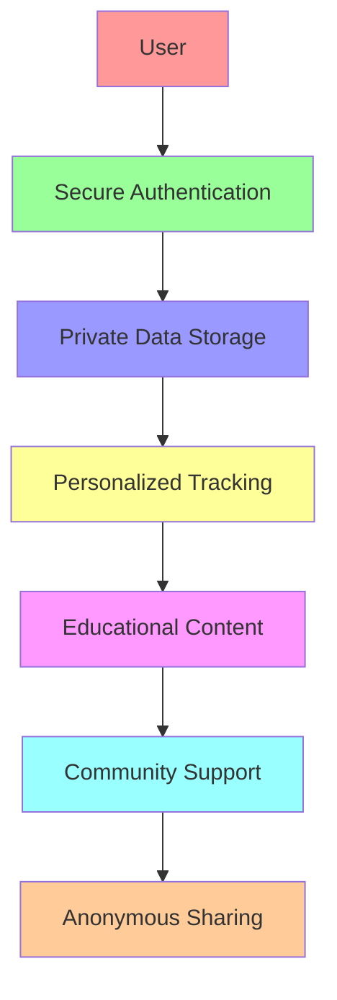

# CycleBuddy - Empowering Menstrual Health Through Web3

<div align="center">
  
</div>


[](https://stellar.org)
[](https://easya.io)

> "Know your body, own your cycle" - A Web3-powered menstrual health companion that puts privacy and education first.

## Vision

CycleBuddy revolutionizes menstrual health tracking by combining the privacy and security of Web3 with an intuitive, educational interface designed specifically for young users. We're not just building another period tracker – we're creating a movement to reshape how people learn about and interact with their bodies.



## Key Features

- **Secure Authentication**: Leveraging Stellar Passkeys for seamless and secure login
- **Private Data Storage**: Decentralized storage ensuring user data privacy
- **Smart Tracking**: AI-powered cycle predictions and insights
- **Educational Hub**: Age-appropriate, clear guidance
- **Anonymous Community**: Safe space for sharing and support
- **Web3 Integration**: Utilizing blockchain for data sovereignty

## Advanced Stellar Features

- **Path Payments for Donations**: Enable users to donate to health initiatives using Stellar's path payment feature, allowing donations in any currency that gets automatically converted.
- **Time-bound Multi-signature Data Sharing**: Share health data with medical professionals using time-limited multi-signature authorization that automatically expires.
- **Claimable Balances for Rewards**: Implement a reward system using Stellar's claimable balances, providing incentives for consistent tracking and educational achievements.
- **Zero-knowledge Proofs for Private Data Validation**: Validate health metrics without revealing sensitive data through zero-knowledge proofs on the Stellar network.
- **Data Monetization with Revenue Sharing**: Allow users to anonymously monetize their aggregated health data with pharmaceutical research, with transparent revenue sharing.
- **Turret-based Automated Health Alerts**: Deploy Stellar Turrets to monitor health data and trigger automated alerts for concerning patterns without compromising privacy.

## Advanced Features Implementation

CycleBuddy now includes cutting-edge blockchain features that leverage Stellar's advanced capabilities:

### 1. Donation System with Path Payments

The donation system allows users to support menstrual health research initiatives in any currency they prefer. Using Stellar's path payment operations, donations are automatically converted to the recipient's preferred currency, enabling global contributions without currency barriers.

**Implementation:**
- Smart contract with path payment optimization
- Initiative registry with automatic currency conversion
- Transparent tracking of funds and impact

### 2. Time-bound Data Sharing

Medical data sharing is secured through Stellar's multi-signature capabilities, allowing users to grant healthcare providers access to specific data for a limited time period. When the time expires, access is automatically revoked.

**Implementation:**
- Multi-signature transactions with time bounds
- Granular access controls for specific data types
- Automatic expiration without requiring user action

### 3. Achievement Rewards with Claimable Balances

The app rewards consistent tracking and educational achievements through Stellar's claimable balances. Users earn tokens for completing tasks, which are securely held in the blockchain until claimed.

**Implementation:**
- Achievements system with milestone tracking
- Reward distribution through claimable balances
- Visual progress indicators and streak tracking

### 4. Zero-knowledge Health Validations

Users can validate health metrics for research or medical purposes without revealing the actual data. For example, proving cycle regularity without exposing cycle dates or confirming age-appropriate information without revealing birth date.

**Implementation:**
- Zero-knowledge proof generation for health metrics
- Validation certificates stored on-chain
- Privacy-preserving health metric verification

### 5. Data Marketplace with Revenue Sharing

Users can contribute anonymized data to research pools and receive compensation through transparent revenue sharing. Researchers purchase access to aggregated data pools while users maintain privacy and control.

**Implementation:**
- Anonymized data contribution mechanisms
- Transparent revenue distribution through smart contracts
- Research data pool management system

### 6. Health Alerts via Stellar Turrets

Automated health monitoring using Stellar Turrets allows for analysis of health patterns without compromising data privacy. The system can detect irregular cycles, concerning symptom patterns, or potential health issues.

**Implementation:**
- Stellar Turret integration for automated monitoring
- Configurable alert thresholds and notification preferences
- Privacy-preserving pattern recognition algorithms

## 🛠 Technical Stack

- **Blockchain**: Stellar Network
- **Authentication**: Stellar Passkeys Kit
- **Frontend**: React.js with Stellar Design System
- **Smart Contracts**: Rust-based Stellar Smart Contracts
- **Data Storage**: Decentralized IPFS/Stellar combination

## Documentation

Detailed documentation can be found in the `/docs` directory:

- [Architecture Overview](docs/architecture.md)
- [User Flows](docs/user-flows.md)
- [Security Model](docs/security.md)
- [Development Guide](docs/development.md)
- [API Documentation](docs/api.md)
- [Smart Contracts](docs/smart-contracts.md)

## Problem & Solution

### The Problem
Traditional period tracking apps often:
- Lack privacy and data security
- Present overwhelming or inappropriate content
- Miss the mark on educational support
- Create anxiety through complex medical forms

### Our Solution
CycleBuddy addresses these issues by:
- Implementing Web3 privacy-first architecture
- Providing age-appropriate, clear guidance
- Building a supportive, anonymous community
- Focusing on education and empowerment

## 🌱 Getting Started

### Prerequisites

- Node.js (v18+)
- npm or yarn
- [Stellar CLI](https://developers.stellar.org/docs/tools/developer-tools/stellar-cli)
- [Freighter Wallet](https://www.freighter.app/) with funded testnet account

### Setup

1. Clone this repository:
   ```
   git clone https://github.com/your-username/CycleBuddy-stellar.git
   cd CycleBuddy-stellar
   ```

2. Install dependencies:
   ```
   npm install
   ```

3. Run the setup script:
   ```
   ./scripts/setup-dev-env.sh
   ```
   
   This script will:
   - Check for required tools
   - Install Stellar CLI if needed
   - Set up the Stellar testnet

### Deploying Contracts to Testnet

To deploy the contracts to the Stellar testnet:

1. Make sure you have [Freighter Wallet](https://www.freighter.app/) installed
2. Fund your testnet account: [Stellar Laboratory](https://laboratory.stellar.org/#account-creator?network=test)
3. Run the deployment script:
   ```
   ./scripts/deploy-contracts.sh
   ```
   
   This script will:
   - Deploy the Registry, Auth, Data, and Community contracts
   - Save the contract IDs to a `.env` file
   - Set up the contracts for use with the app

### Running the App

To run the application:

```
npm run dev
```

The app will be available at: [http://localhost:3000](http://localhost:3000)

## Contract Structure

The application uses the following Soroban (Stellar) smart contracts:

1. **Registry Contract**: Central contract registry that tracks the addresses of all other contracts
2. **Auth Contract**: Handles passkey-based authentication and user identity
3. **Data Contract**: Stores encrypted health data with privacy controls
4. **Community Contract**: Manages social and educational features
5. **Donation Contract**: Enables path payments for donations to health initiatives
6. **Data Sharing Contract**: Manages time-bound multi-signature data sharing
7. **Rewards Contract**: Implements claimable balances for achievement rewards
8. **ZK Validation Contract**: Facilitates zero-knowledge proofs for private data validation
9. **Data Marketplace Contract**: Enables data monetization with revenue sharing
10. **Health Alerts Contract**: Manages turret-based automated health alerts

## Using the Testnet Integration

The application can work in two modes:

1. **Simulated Mode**: When Freighter wallet is not available, the app uses simulated blockchain data
2. **Testnet Mode**: When Freighter wallet is connected, the app interacts with real contracts on the Stellar testnet

To use the testnet integration:

1. Install [Freighter Wallet](https://www.freighter.app/)
2. Create and fund a testnet account
3. Deploy contracts using the provided script
4. Update your `.env` file with the deployed contract IDs
5. Restart the application

## Troubleshooting

### Contract ID Issues

If you see errors related to invalid contract IDs:

1. Make sure you've deployed the contracts to testnet
2. Check that your `.env` file contains the correct contract IDs
3. Restart the application

### Freighter Connection Issues

If you're having issues connecting to Freighter:

1. Make sure Freighter is installed and unlocked
2. Switch to the Stellar testnet in Freighter
3. Refresh the application

## License

This project is licensed under the MIT License - see the LICENSE file for details.

## Contributing

We welcome contributions! Please see our [Contributing Guide](docs/contributing.md) for details.

## Acknowledgments

- Stellar Foundation for their amazing blockchain platform
- EasyA Consensus Hackathon for the opportunity
- Our early users and community for valuable feedback

## Contact

- Email: bradyalimedi@gmail.com

## Contract Deployment Workflow

### Building and Deploying Contracts

This project uses a streamlined workflow for building and testing Stellar Soroban contracts. The main tools for contract management are:

1. **Makefile** - Contains all commands for building, testing, and deploying contracts
2. **DeployContracts Component** - Web UI for downloading contract files and providing deployment instructions

### Common Contract Operations

| Command | Description |
|---------|-------------|
| `npm run build:contracts` | Build all contracts and copy to public directory |
| `npm run test:contracts` | Run all contract tests |
| `npm run deploy:contracts` | Deploy contracts to Stellar testnet using soroban CLI |
| `npm run deploy:testnet` | Deploy contracts using stellar CLI and save IDs to .env |
| `npm run clean` | Clean build artifacts |
| `npm run optimize:contracts` | Optimize compiled contracts |
| `npm run generate:bindings` | Generate TypeScript bindings |

### Manual Deployment via Web UI

For a more user-friendly approach, you can use the DeployContracts page in the app:

1. Connect your Freighter wallet
2. Download each contract WASM file
3. Follow the on-screen instructions to upload and deploy each contract
4. Use the contract hash returned by each upload when deploying

This approach is useful when you need to deploy contracts from a different environment than your development machine.

### Deployment Command Details

Under the hood, these commands use the Makefile. To view the specific commands and options:

```bash
# View available make targets
make help

# Specify a custom Stellar address for deployment
make deploy STELLAR_ADDRESS=GBUKOFF6FX6767LKKOD3P7KAS43I3Z7CNUBPCH33YZKPPR53ZDHAHCER
```

---