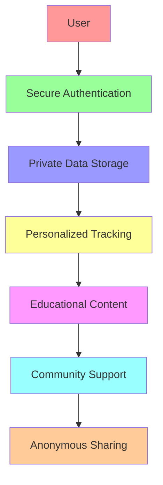

# CycleBuddy - Empowering Menstrual Health Through Web3

<div align="center">
  
</div>


[](https://stellar.org)
[](https://easya.io)

> "Know your body, own your cycle" - A Web3-powered menstrual health companion that puts privacy and education first.

## Vision

CycleBuddy revolutionizes menstrual health tracking by combining the privacy and security of Web3 with an intuitive, educational interface designed specifically for young users. We're not just building another period tracker – we're creating a movement to reshape how people learn about and interact with their bodies.



## Key Features

- **Secure Authentication**: Leveraging Stellar Passkeys for seamless and secure login
- **Private Data Storage**: Decentralized storage ensuring user data privacy
- **Smart Tracking**: AI-powered cycle predictions and insights
- **Educational Hub**: Age-appropriate, clear guidance
- **Anonymous Community**: Safe space for sharing and support
- **Web3 Integration**: Utilizing blockchain for data sovereignty

## 🛠 Technical Stack

- **Blockchain**: Stellar Network
- **Authentication**: Stellar Passkeys Kit
- **Frontend**: React.js with Stellar Design System
- **Smart Contracts**: Rust-based Stellar Smart Contracts
- **Data Storage**: Decentralized IPFS/Stellar combination

## Documentation

Detailed documentation can be found in the `/docs` directory:

- [Architecture Overview](docs/architecture.md)
- [User Flows](docs/user-flows.md)
- [Security Model](docs/security.md)
- [Development Guide](docs/development.md)
- [API Documentation](docs/api.md)
- [Smart Contracts](docs/smart-contracts.md)

## Problem & Solution

### The Problem
Traditional period tracking apps often:
- Lack privacy and data security
- Present overwhelming or inappropriate content
- Miss the mark on educational support
- Create anxiety through complex medical forms

### Our Solution
CycleBuddy addresses these issues by:
- Implementing Web3 privacy-first architecture
- Providing age-appropriate, clear guidance
- Building a supportive, anonymous community
- Focusing on education and empowerment

## 🌱 Getting Started

```bash
# Clone the repository
git clone https://github.com/yourusername/cyclebuddy-stellar

# Install dependencies
npm install

# Set up environment variables
cp .env.example .env

# Run development server
npm run dev
```

## Contributing

We welcome contributions! Please see our [Contributing Guide](docs/contributing.md) for details.

## License

This project is licensed under the MIT License - see the [LICENSE](LICENSE) file for details.

## Acknowledgments

- Stellar Foundation for their amazing blockchain platform
- EasyA Consensus Hackathon for the opportunity
- Our early users and community for valuable feedback

## Contact

- Email: bradyalimedi@gmail.com

---