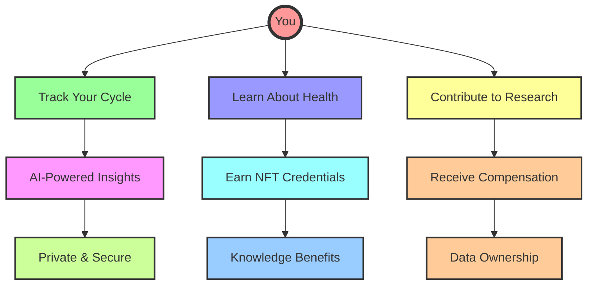
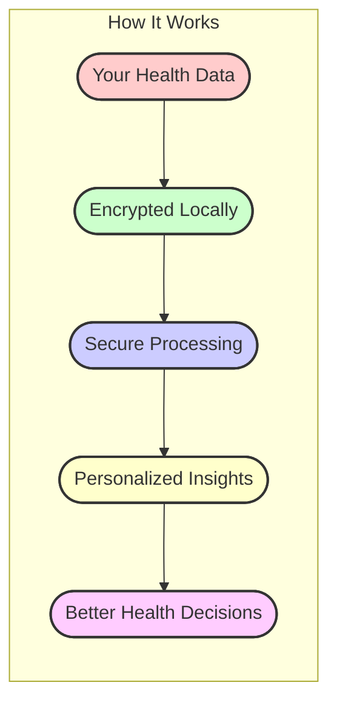
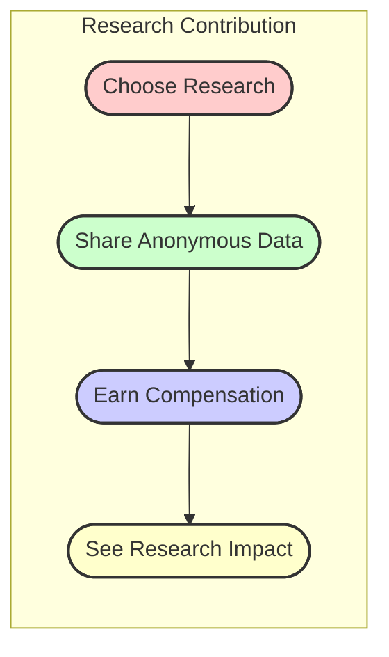
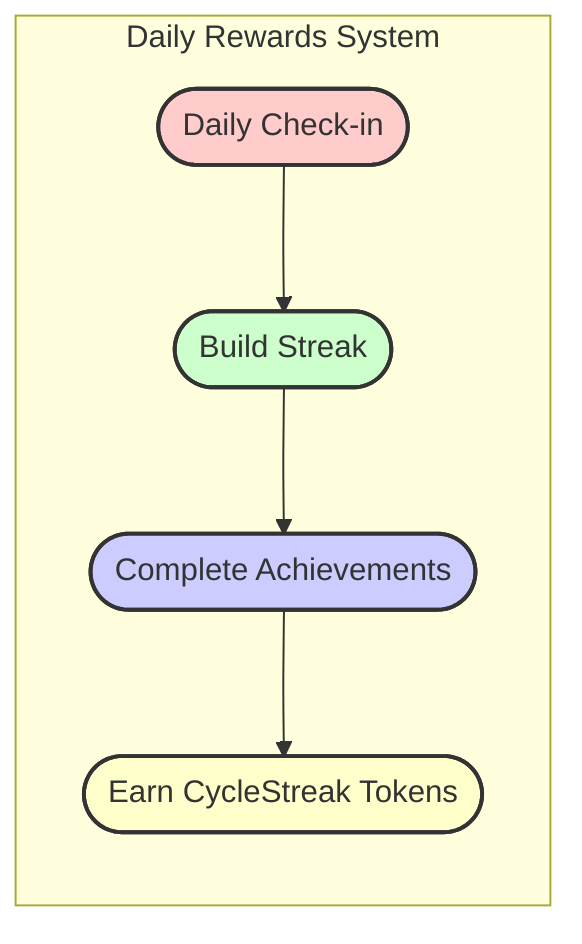
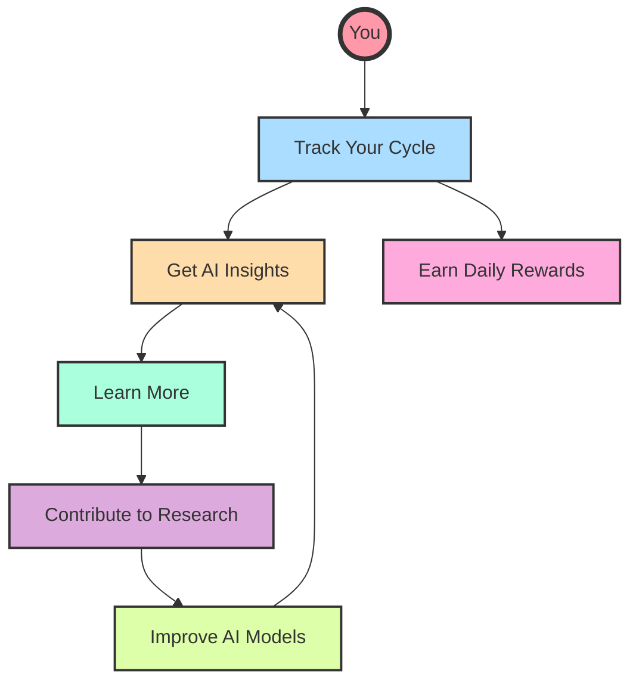
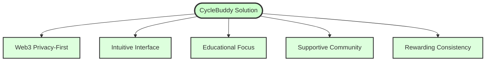
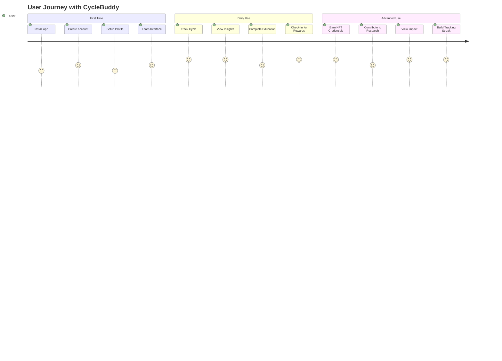

# CycleBuddy - Empowering Menstrual Health Through Web3

<div align="center">
  
</div>


[](https://stellar.org)
[](https://bahamut.io)
[](https://easya.io)

> "Know your body, Own your cycle" - A Web3-powered menstrual health companion that puts privacy and education first.

## Vision

CycleBuddy revolutionizes menstrual health tracking by combining the privacy and security of Web3 with an intuitive, educational interface designed specifically for young users. We're not just building another period tracker – we're creating a movement to reshape how people learn about and interact with their bodies.



## Key Features

- **Secure Authentication**: Leveraging Stellar Passkeys for seamless and secure login
- **Private Data Storage**: Decentralized storage ensuring user data privacy
- **Smart Tracking**: AI-powered cycle predictions and insights
- **Educational Hub**: Age-appropriate, clear guidance
- **Anonymous Community**: Safe space for sharing and support
- **Web3 Integration**: Utilizing blockchain for data sovereignty
- **Daily Streak Rewards**: Earn CycleStreak tokens for consistent tracking on Bahamut blockchain

## Breakthrough Features

CycleBuddy's breakthrough features that set it apart from any other health application:

### 1. AI-Powered Health Insights with Stellar Turrets



- **Advanced Pattern Detection**: Identifies connections in your health data that are difficult to spot manually
- **Personalized Health Intelligence**: Tailored insights based on your unique patterns
- **Early Warning System**: Notices potential health concerns before they become serious
- **Privacy-Preserving Analysis**: All analysis happens on encrypted data - your private information stays private

### 2. NFT-Based Educational Achievement System


- **Learn-to-Earn Health Curriculum**: Complete educational modules to earn unique NFT credentials
- **Verifiable Health Knowledge**: Your NFTs prove your health knowledge achievements
- **Partner Benefits**: Access special services from healthcare providers based on your credentials
- **Community Engagement**: Become a mentor to help others as you build your knowledge

### 3. Decentralized Research Contribution Marketplace



- **User-Controlled Data Sharing**: You decide exactly what anonymous data to contribute
- **Smart Contract Compensation**: Automatic payment when your data meets quality criteria
- **Reputation System**: Earn higher compensation as you build a reliable contribution history
- **Direct Research Impact**: Track how your data helps important health research

### 4. Daily Tracking Rewards with Bahamut Blockchain



- **Daily Check-in System**: Log in daily to maintain your streak and earn rewards
- **Achievement-based Rewards**: Complete milestones to earn bonus tokens
- **Fast Transaction Processing**: Bahamut's PoSA consensus provides ~2 second block times for instant rewards
- **MetaMask Integration**: Seamless Web3 experience with popular wallet support
- **ERC-20 Token Standard**: Use CycleStreak tokens in the broader ecosystem

## How Features Work Together



## 🛠 Technical Stack

- **Blockchains**: 
  - Stellar Network: Core application functionality
  - Bahamut Blockchain: Daily rewards and tracking system
- **Authentication**: Stellar Passkeys Kit
- **Frontend**: React.js with Chakra UI
- **Smart Contracts**: 
  - Rust-based Stellar Smart Contracts
  - Solidity contracts for Bahamut EVM
- **Data Storage**: Decentralized IPFS/Stellar combination
- **Wallets**: Freighter (Stellar) and MetaMask (Bahamut)

## Documentation

Detailed documentation can be found in the `/docs` directory:

- [Architecture Overview](docs/system-architecture.md)
- [Breakthrough Features Implementation](docs/breakthrough-features-implementation.md)
- [User Flows](docs/user-flows.md)
- [Security Model](docs/security.md)
- [Development Guide](docs/development.md)
- [API Documentation](docs/api.md)
- [Smart Contracts](docs/smart-contracts.md)
- [Daily Rewards System](docs/daily-rewards.md)

## Problem & Solution

### The Problem


### Our Solution



## 🌱 Getting Started

### Prerequisites

- Node.js (v18+)
- npm or yarn
- [Stellar CLI](https://developers.stellar.org/docs/tools/developer-tools/stellar-cli)
- [Freighter Wallet](https://www.freighter.app/) with funded testnet account
- [MetaMask Wallet](https://metamask.io/) for Bahamut interaction

### Setup

1. Clone this repository:
   ```
   git clone https://github.com/your-username/CycleBuddy-stellar.git
   cd CycleBuddy-stellar
   ```

2. Install dependencies:
   ```
   npm install
   ```

3. Run the setup script:
   ```
   ./scripts/setup-dev-env.sh
   ```
   
   This script will:
   - Check for required tools
   - Install Stellar CLI if needed
   - Set up the Stellar testnet

### Deploying Contracts

#### Stellar Contracts

To deploy the Stellar contracts to the testnet:

1. Make sure you have [Freighter Wallet](https://www.freighter.app/) installed
2. Fund your testnet account: [Stellar Laboratory](https://laboratory.stellar.org/#account-creator?network=test)
3. Run the deployment script:
   ```
   npm run deploy:contracts
   ```

#### Bahamut Contracts

To deploy the daily rewards system to Bahamut testnet:

1. Create a `.env` file in the `contracts/bahamut` directory (refer to `.env.example`)
2. Make sure you have [MetaMask](https://metamask.io/) installed with a funded Bahamut testnet account
3. Run the deployment script:
   ```
   npm run bahamut:deploy:testnet
   ```

### Running the App

To run the application:

```
npm run dev
```

The app will be available at: [http://localhost:3000](http://localhost:3000)

## User Experience



## License

This project is licensed under the MIT License - see the LICENSE file for details.

## Contributing

We welcome contributions! Please see our [Contributing Guide](docs/contributing.md) for details.

## Acknowledgments

- Stellar Foundation for their amazing blockchain platform
- Bahamut Network for their fast EVM-compatible blockchain
- EasyA Consensus Hackathon for the opportunity
- Our early users and community for valuable feedback

## Contact

- Email: bradyalimedi@gmail.com

## Contract Deployment Workflow

### Building and Deploying Contracts

This project uses streamlined workflows for building and testing both Stellar Soroban contracts and Bahamut EVM contracts.

#### Stellar Contracts

1. **Makefile** - Contains all commands for building, testing, and deploying contracts
2. **DeployContracts Component** - Web UI for downloading contract files and providing deployment instructions

| Command | Description |
|---------|-------------|
| `npm run build:contracts` | Build all Stellar contracts and copy to public directory |
| `npm run test:contracts` | Run all Stellar contract tests |
| `npm run deploy:contracts` | Deploy Stellar contracts to testnet using soroban CLI |
| `npm run deploy:testnet` | Deploy Stellar contracts using stellar CLI and save IDs to .env |

#### Bahamut Contracts

1. **Hardhat** - Framework for Ethereum/EVM development
2. **Deployment Scripts** - Automated scripts for contract deployment and verification

| Command | Description |
|---------|-------------|
| `npm run bahamut:compile` | Compile Solidity contracts using Hardhat |
| `npm run bahamut:test` | Run tests for Bahamut contracts |
| `npm run bahamut:deploy:testnet` | Deploy contracts to Bahamut testnet |
| `npm run bahamut:deploy:mainnet` | Deploy contracts to Bahamut mainnet |
| `npm run bahamut:verify` | Verify contracts on Bahamut Explorer |

---

# CycleBuddy Bahamut Contracts

This directory contains the smart contracts for the CycleBuddy app on the Bahamut blockchain.

## Development Setup

### Prerequisites

- Node.js (v14+)
- NPM or Yarn

### Installation

1. Install dependencies:
   ```
   npm install
   ```

2. Compile contracts:
   ```
   npx hardhat compile
   ```

### Local Development

1. Start a local Hardhat node in a separate terminal:
   ```
   npx hardhat node
   ```

2. The contracts are preconfigured to work with the local Hardhat node. The default accounts and deployed contract addresses are already set up in the `deployed-addresses.json` file.

3. If you want to deploy the contracts manually:
   ```
   npx hardhat run --network localhost scripts/deploy-local.js
   ```

### Contract Addresses

The `deployed-addresses.json` file contains the addresses of the deployed contracts:

- `CycleStreakToken`: `0x5FbDB2315678afecb367f032d93F642f64180aa3`
- `DailyRewards`: `0xe7f1725E7734CE288F8367e1Bb143E90bb3F0512`

These are the default addresses when deploying to the local Hardhat node.

### Testing with MetaMask

1. Add the local Hardhat network to MetaMask:
   - Network Name: Hardhat Local
   - RPC URL: http://127.0.0.1:8545
   - Chain ID: 1337
   - Currency Symbol: ETH

2. Import one of the test accounts using the private key:
   - Account #0: `0xac0974bec39a17e36ba4a6b4d238ff944bacb478cbed5efcae784d7bf4f2ff80`

3. Now you can interact with the contracts through the CycleBuddy app UI.