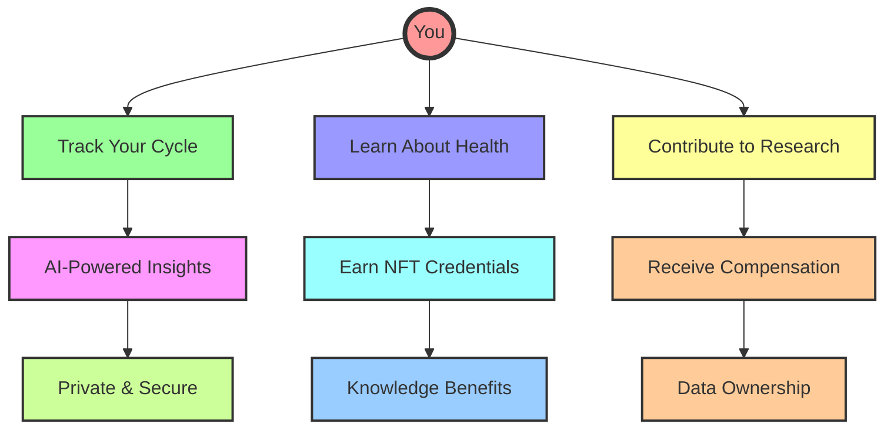
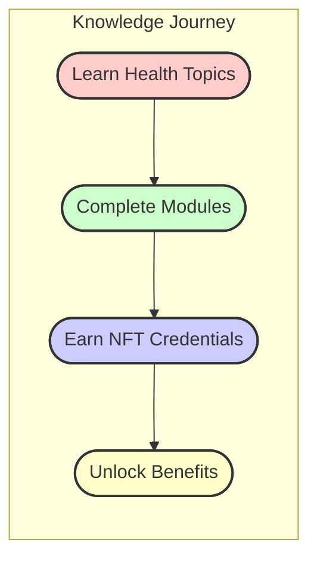
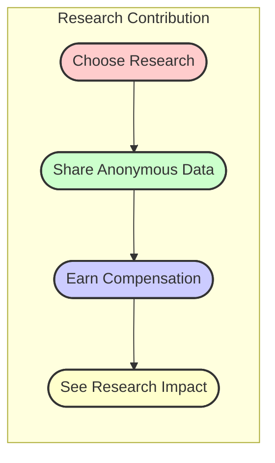
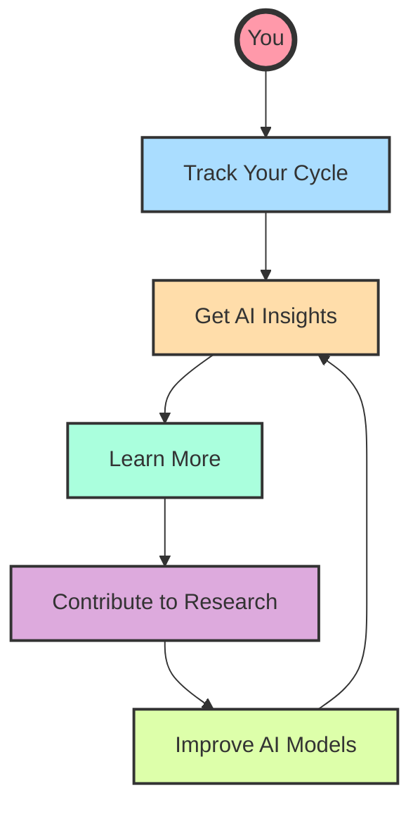
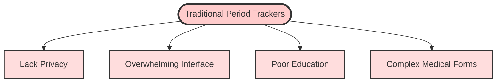
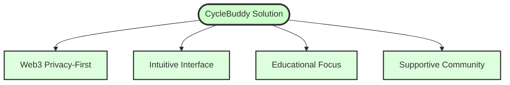
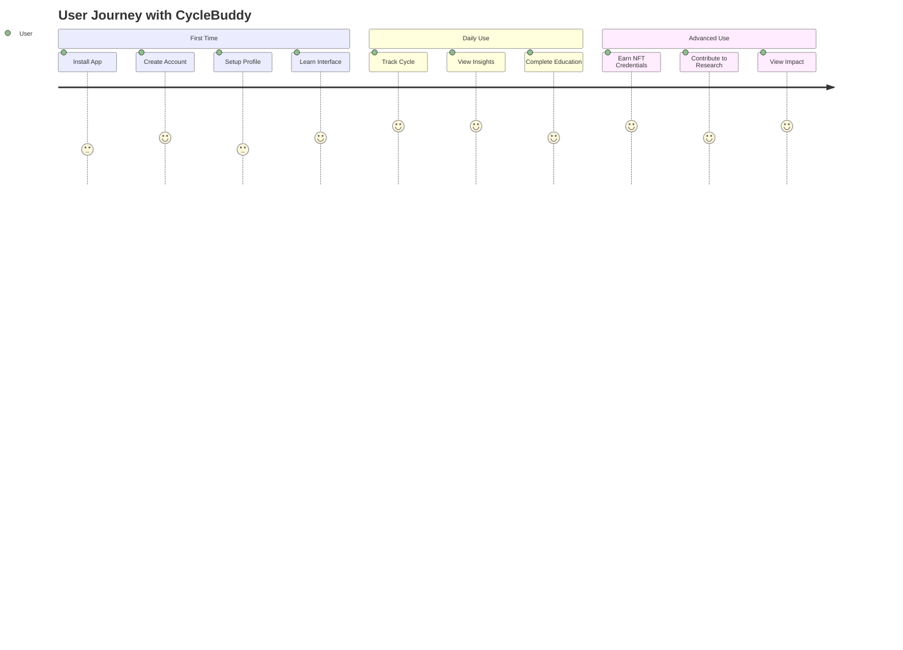

# CycleBuddy - Empowering Menstrual Health Through Web3

<div align="center">
  
</div>


[](https://stellar.org)
[](https://easya.io)

> "Know your body, Own your cycle" - A Web3-powered menstrual health companion that puts privacy and education first.

## Vision

CycleBuddy revolutionizes menstrual health tracking by combining the privacy and security of Web3 with an intuitive, educational interface designed specifically for young users. We're not just building another period tracker – we're creating a movement to reshape how people learn about and interact with their bodies.



## Key Features

- **Secure Authentication**: Leveraging Stellar Passkeys for seamless and secure login
- **Private Data Storage**: Decentralized storage ensuring user data privacy
- **Smart Tracking**: AI-powered cycle predictions and insights
- **Educational Hub**: Age-appropriate, clear guidance
- **Anonymous Community**: Safe space for sharing and support
- **Web3 Integration**: Utilizing blockchain for data sovereignty

## Market Cap

- **Rapidly expanding niche**: The global menstrual‑health‑apps market is valued at US $1.75 billion in 2024 and is projected to reach US $10.38 billion by 2034, a stunning 19.5 % CAGR (Precedence Research). 


- **Mass adoption, unmet needs**: More than 50 million people already track their cycles with an app, yet woman say mainstream tools are too clinical, ad‑heavy, or privacy‑risky. 

- **Part of a booming FemTech wave**: Women's‑health tech overall will top US $60 billion in 2025 and nearly double to ~US $130 billion by 2034, signalling strong investor interest and exit potential. 


## Breakthrough Features

CycleBuddy's three breakthrough features that set it apart from any other health application:

### 1. AI-Powered Health Insights with Stellar Turrets


- **Advanced Pattern Detection**: Identifies connections in your health data that are difficult to spot manually
- **Personalized Health Intelligence**: Tailored insights based on your unique patterns
- **Early Warning System**: Notices potential health concerns before they become serious
- **Privacy-Preserving Analysis**: All analysis happens on encrypted data - your private information stays private

### 2. NFT-Based Educational Achievement System



- **Learn-to-Earn Health Curriculum**: Complete educational modules to earn unique NFT credentials
- **Verifiable Health Knowledge**: Your NFTs prove your health knowledge achievements
- **Partner Benefits**: Access special services from healthcare providers based on your credentials
- **Community Engagement**: Become a mentor to help others as you build your knowledge

### 3. Decentralized Research Contribution Marketplace



- **User-Controlled Data Sharing**: You decide exactly what anonymous data to contribute
- **Smart Contract Compensation**: Automatic payment when your data meets quality criteria
- **Reputation System**: Earn higher compensation as you build a reliable contribution history
- **Direct Research Impact**: Track how your data helps important health research

## How Features Work Together



## 🛠 Technical Stack

- **Blockchain**: Stellar Network
- **Authentication**: Stellar Passkeys Kit
- **Frontend**: React.js with Chakra UI
- **Smart Contracts**: Rust-based Stellar Smart Contracts
- **Data Storage**: Decentralized IPFS/Stellar combination

## Documentation

Detailed documentation can be found in the `/docs` directory:

- [Architecture Overview](docs/system-architecture.md)
- [Breakthrough Features Implementation](docs/breakthrough-features-implementation.md)
- [User Flows](docs/user-flows.md)
- [Security Model](docs/security.md)
- [Development Guide](docs/development.md)
- [API Documentation](docs/api.md)
- [Smart Contracts](docs/smart-contracts.md)

## Problem & Solution

### The Problem



### Our Solution



## 🌱 Getting Started

### Prerequisites

- Node.js (v18+)
- npm or yarn
- [Stellar CLI](https://developers.stellar.org/docs/tools/developer-tools/stellar-cli)
- [Freighter Wallet](https://www.freighter.app/) with funded testnet account

### Setup

1. Clone this repository:
   ```
   git clone https://github.com/your-username/CycleBuddy-stellar.git
   cd CycleBuddy-stellar
   ```

2. Install dependencies:
   ```
   npm install
   ```

3. Run the setup script:
   ```
   ./scripts/setup-dev-env.sh
   ```
   
   This script will:
   - Check for required tools
   - Install Stellar CLI if needed
   - Set up the Stellar testnet

### Deploying Contracts to Testnet

To deploy the contracts to the Stellar testnet:

1. Make sure you have [Freighter Wallet](https://www.freighter.app/) installed
2. Fund your testnet account: [Stellar Laboratory](https://laboratory.stellar.org/#account-creator?network=test)
3. Run the deployment script:
   ```
   ./scripts/deploy-contracts.sh
   ```
   
   This script will:
   - Deploy the Registry, Auth, Data, and Community contracts
   - Save the contract IDs to a `.env` file
   - Set up the contracts for use with the app

### Running the App

To run the application:

```
npm run dev
```

The app will be available at: [http://localhost:3000](http://localhost:3000)

## User Experience



## License

This project is licensed under the MIT License - see the LICENSE file for details.

## Contributing

We welcome contributions! Please see our [Contributing Guide](docs/contributing.md) for details.

## Acknowledgments

- Stellar Foundation for their amazing blockchain platform
- EasyA Consensus Hackathon for the opportunity
- Our early users and community for valuable feedback

## Contact

- Email: bradyalimedi@gmail.com

## Contract Deployment Workflow

### Building and Deploying Contracts

This project uses a streamlined workflow for building and testing Stellar Soroban contracts. The main tools for contract management are:

1. **Makefile** - Contains all commands for building, testing, and deploying contracts
2. **DeployContracts Component** - Web UI for downloading contract files and providing deployment instructions

### Common Contract Operations

| Command | Description |
|---------|-------------|
| `npm run build:contracts` | Build all contracts and copy to public directory |
| `npm run test:contracts` | Run all contract tests |
| `npm run deploy:contracts` | Deploy contracts to Stellar testnet using soroban CLI |
| `npm run deploy:testnet` | Deploy contracts using stellar CLI and save IDs to .env |
| `npm run clean` | Clean build artifacts |
| `npm run optimize:contracts` | Optimize compiled contracts |
| `npm run generate:bindings` | Generate TypeScript bindings |

### Manual Deployment via Web UI

For a more user-friendly approach, you can use the DeployContracts page in the app:

1. Connect your Freighter wallet
2. Download each contract WASM file
3. Follow the on-screen instructions to upload and deploy each contract
4. Use the contract hash returned by each upload when deploying

This approach is useful when you need to deploy contracts from a different environment than your development machine.

### Deployment Command Details

Under the hood, these commands use the Makefile. To view the specific commands and options:

```bash
# View available make targets
make help

# Specify a custom Stellar address for deployment
make deploy STELLAR_ADDRESS=GBUKOFF6FX6767LKKOD3P7KAS43I3Z7CNUBPCH33YZKPPR53ZDHAHCER
```

---
