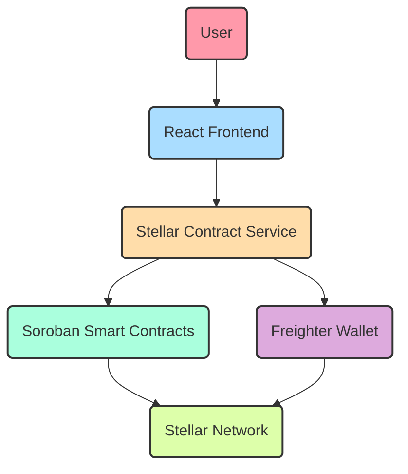
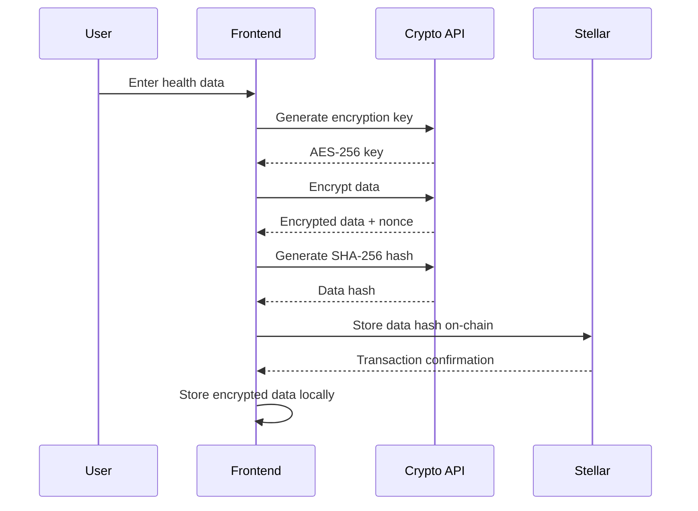
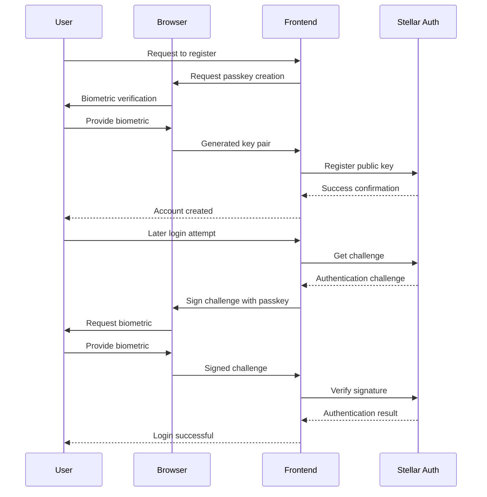
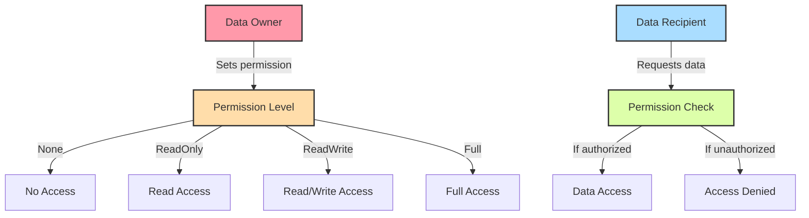
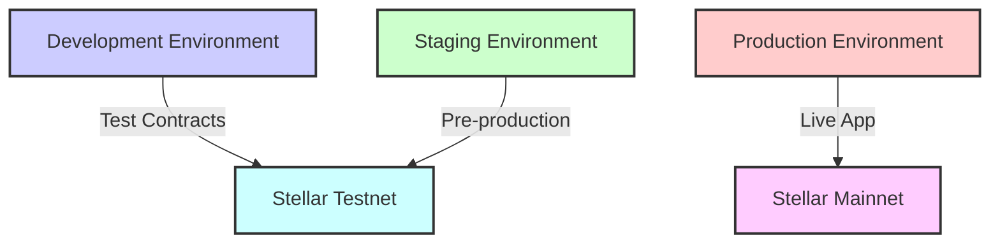

# CycleBuddy: Stellar Blockchain Integration

## Overview

CycleBuddy leverages the Stellar blockchain to create a secure, private, and decentralized menstrual health tracking application. This document explains how Stellar's technology is implemented throughout the application, highlighting the key components and features for your hackathon presentation.

## Core Architecture



## 1. Soroban Smart Contracts

CycleBuddy utilizes Soroban, Stellar's smart contract platform, to implement core features through Rust-based smart contracts:

### Registry Contract
- Acts as a central directory for all other contracts
- Enables dynamic contract discovery and updates

### Auth Contract
- Implements Stellar Passkeys for secure authentication
- Features:
  - Registration of user passkeys (using WebAuthn)
  - Challenge-response authentication
  - Account recovery mechanisms with recovery keys
  - Signature verification for secure transactions

### Data Contract
- Manages the encrypted health data storage
- Key functionalities:
  - Store encrypted menstrual cycle data on-chain
  - Granular permission management system for data sharing
  - Client-side encryption with only hashes stored on-chain
  - Data access control through AccessLevel enumeration

### Community Contract
- Facilitates anonymous community interactions
- Features:
  - Post creation and moderation
  - Anonymous engagement options
  - Reputation and voting systems

### Feature-specific Contracts
- Donation Contract: Enables charitable donations in XLM
- Data Sharing Contract: Controlled sharing of anonymized health data
- Data Marketplace Contract: Monetization platform for anonymized data contributions
- ZK Validation Contract: Zero-knowledge proof validation for health claims
- Health Alerts Contract: Privacy-preserving health notification system

## 2. Stellar Integration Service

The `contractService.ts` module serves as the bridge between the frontend and Stellar blockchain:

```typescript
// Key integration points
class StellarContractService {
  // Initializes connection to Soroban RPC server
  constructor() {
    this.server = new Server(SERVER_SOROBAN_URL);
    // Contract initialization
  }
  
  // Connects to user's Freighter wallet
  async connectWallet(): Promise<boolean> {
    // Wallet connection implementation
  }
  
  // Interacts with Auth contract for passkey registration
  async registerPasskey(publicKey: string): Promise<boolean> {
    // Contract interaction
  }
  
  // Stores encrypted data via Data contract
  async storeData(
    data: Uint8Array,
    dataId: string,
    dataType: string,
    nonce: Uint8Array
  ): Promise<boolean> {
    // Contract interaction for data storage
  }
  
  // Additional contract interaction methods
  // ...
}
```

## 3. Privacy-Preserving Data Architecture

CycleBuddy implements a unique privacy model using Stellar's capabilities:



Key privacy features:
- Client-side encryption using Web Crypto API
- Only cryptographic hashes stored on-chain
- Zero-knowledge architecture where possible
- Granular permission management

## 4. Stellar Passkeys Authentication

CycleBuddy implements Stellar Passkeys for secure, passwordless authentication:



Implementation details:
- Uses WebAuthn standard for passkey generation
- Biometric security support (fingerprint/face)
- Recovery mechanisms through backup keys
- Chain-based identity verification

## 5. On-Chain Data Permissions

The permission system allows controlled sharing of health data:



Implementation in Soroban:
```rust
pub enum AccessLevel {
    None = 0,
    ReadOnly = 1,
    ReadWrite = 2,
    Full = 3,
}

pub fn grant_permission(
    env: Env,
    grantor: Address,
    grantee: Address,
    level: AccessLevel
) -> Result<(), DataError> {
    grantor.require_auth();
    env.storage().instance().set(&DataKey::Permission(grantor.clone(), grantee.clone()), &level);
    // Event emission...
    Ok(())
}
```

## 6. Stellar Advantages for Health Data

CycleBuddy leverages specific Stellar features that make it ideal for health applications:

1. **Fast, Low-Cost Transactions**
   - Sub-5 second confirmation times
   - Minimal transaction costs (~0.00001 XLM)
   - Efficient for frequent health data updates

2. **Robust Privacy Controls**
   - Fine-grained permission system
   - Data compartmentalization
   - Hash-based reference architecture

3. **Soroban Contract Capabilities**
   - Rust-based contracts for high security
   - Resource-efficient design
   - Strong type system for health data integrity

4. **Cross-Border Accessibility**
   - Global accessibility for international users
   - Minimal technical requirements
   - Mobile-friendly implementation

5. **Sustainable Architecture**
   - Energy-efficient consensus mechanism
   - Long-term sustainability
   - Low hardware requirements for participation

## 7. Deployment Architecture

CycleBuddy uses a multi-environment deployment strategy:



Deployment workflow:
1. Local development with mock contracts
2. Testnet deployment for integration testing
3. Contract auditing and security verification
4. Mainnet deployment with formal verification

## 8. Future Stellar Integrations

Planned enhancements to the Stellar integration:

1. **Stellar Turrets Integration**
   - Secure off-chain computation
   - Advanced AI analytics on encrypted data
   - Federated processing of health insights

2. **Stellar Asset Integration**
   - Health data monetization tokens
   - Reward systems for consistent tracking
   - Educational achievement tokens

3. **Multi-signature Health Directives**
   - Shared health management between users and providers
   - Emergency access protocols
   - Caregiver authorization systems

4. **Path Payment Integration**
   - Cross-asset donation capabilities
   - Seamless currency conversion for global users
   - Integrated marketplace payments

## Presentation Tips

When presenting CycleBuddy's Stellar integration:

1. **Demo the Authentication Flow**
   - Show the passkey registration process
   - Demonstrate the biometric authentication
   - Highlight the security advantages over passwords

2. **Visualize the Data Privacy**
   - Show how data is encrypted client-side
   - Demonstrate that only hashes are stored on-chain
   - Explain the permission management system

3. **Emphasize Technical Innovations**
   - Highlight the novel use of Soroban contracts for health data
   - Explain the hash anchor pattern for privacy
   - Showcase the WebAuthn integration with Stellar

4. **Address Common Questions**
   - Explain how data is recovered if a device is lost
   - Discuss the regulatory compliance measures
   - Detail the security auditing process

## Conclusion

CycleBuddy represents a pioneering implementation of Stellar blockchain technology for sensitive health data management. By leveraging Soroban smart contracts, client-side encryption, and innovative authentication methods, the application achieves a balance of security, privacy, and usability that traditional health tracking applications cannot match.

The architecture demonstrates how blockchain technology can be applied to real-world health challenges while maintaining the highest standards of data protection and user control. 