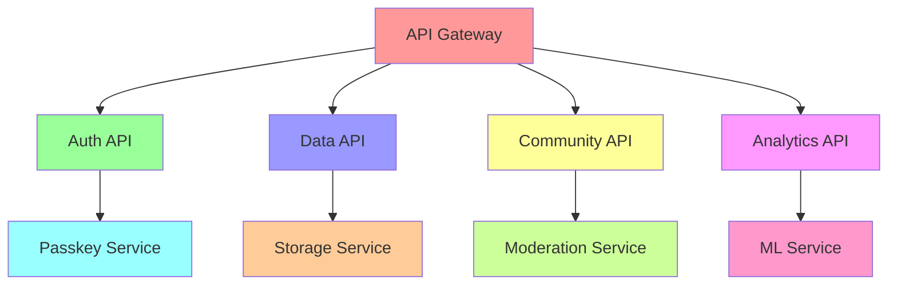
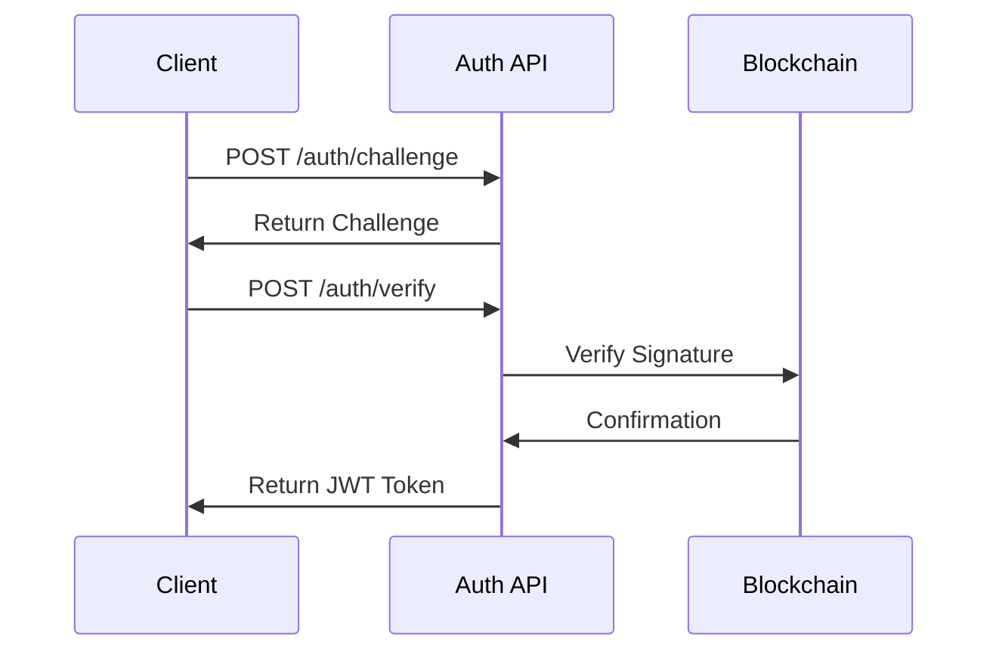
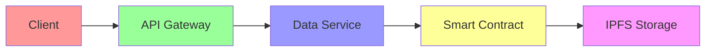
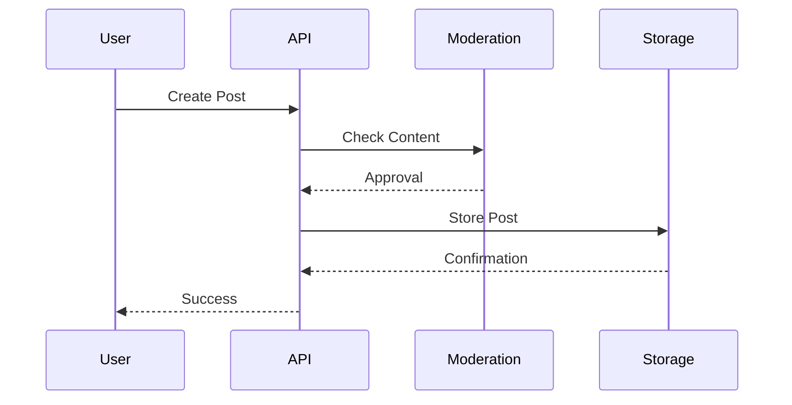
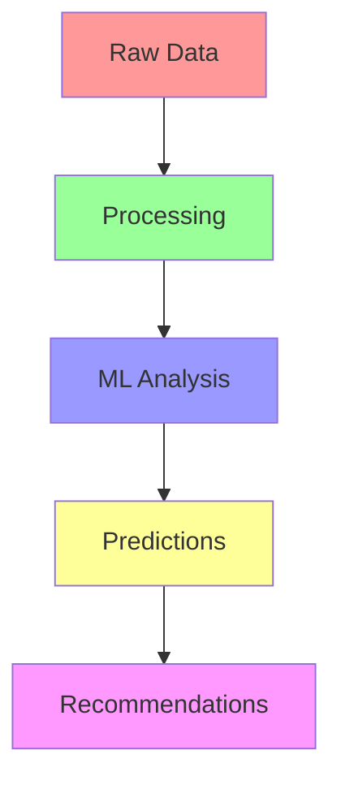
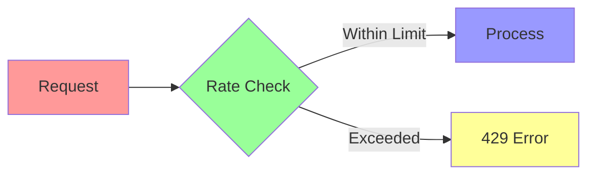

# 🔌 CycleBuddy API Documentation

## Overview

The CycleBuddy API provides secure endpoints for managing user data, authentication, and community interactions. All endpoints use HTTPS and require authentication unless specified otherwise.

## API Architecture



## Base URL

```
Production: https://api.cyclebuddy.com/v1
Staging: https://api-staging.cyclebuddy.com/v1
Development: http://localhost:3000/v1
```

## Authentication

### Passkey Authentication Flow



### Endpoints

#### 1. Request Authentication Challenge
```http
POST /auth/challenge
Content-Type: application/json

{
  "username": "string"
}
```

Response:
```json
{
  "challenge": "string",
  "expires_at": "timestamp"
}
```

#### 2. Verify Authentication
```http
POST /auth/verify
Content-Type: application/json

{
  "challenge": "string",
  "signature": "string"
}
```

Response:
```json
{
  "token": "string",
  "expires_at": "timestamp"
}
```

## User Data API

### Data Flow



### Endpoints

#### 1. Store Cycle Data
```http
POST /data/cycle
Authorization: Bearer <token>
Content-Type: application/json

{
  "date": "2025-05-14",
  "symptoms": ["string"],
  "mood": "string",
  "notes": "string"
}
```

Response:
```json
{
  "id": "string",
  "timestamp": "string",
  "status": "success"
}
```

#### 2. Retrieve Cycle History
```http
GET /data/cycle
Authorization: Bearer <token>
Query Parameters:
  - start_date: string (YYYY-MM-DD)
  - end_date: string (YYYY-MM-DD)
```

Response:
```json
{
  "cycles": [
    {
      "id": "string",
      "date": "string",
      "symptoms": ["string"],
      "mood": "string",
      "notes": "string"
    }
  ]
}
```

## Community API

### Interaction Flow



### Endpoints

#### 1. Create Post
```http
POST /community/posts
Authorization: Bearer <token>
Content-Type: application/json

{
  "title": "string",
  "content": "string",
  "tags": ["string"],
  "anonymous": boolean
}
```

Response:
```json
{
  "id": "string",
  "timestamp": "string",
  "status": "pending|approved|rejected"
}
```

#### 2. Get Posts
```http
GET /community/posts
Authorization: Bearer <token>
Query Parameters:
  - page: number
  - limit: number
  - tags: string[]
```

Response:
```json
{
  "posts": [
    {
      "id": "string",
      "title": "string",
      "content": "string",
      "tags": ["string"],
      "created_at": "timestamp",
      "author": "anonymous|username"
    }
  ],
  "pagination": {
    "total": number,
    "page": number,
    "limit": number
  }
}
```

## Analytics API

### Data Flow



### Endpoints

#### 1. Get Predictions
```http
GET /analytics/predictions
Authorization: Bearer <token>
```

Response:
```json
{
  "next_cycle": {
    "start_date": "string",
    "confidence": number
  },
  "symptoms": [
    {
      "type": "string",
      "likelihood": number
    }
  ]
}
```

#### 2. Get Insights
```http
GET /analytics/insights
Authorization: Bearer <token>
Query Parameters:
  - period: string (3m|6m|1y)
```

Response:
```json
{
  "cycle_length": {
    "average": number,
    "variation": number
  },
  "common_symptoms": [
    {
      "name": "string",
      "frequency": number
    }
  ],
  "patterns": [
    {
      "type": "string",
      "description": "string"
    }
  ]
}
```

## Error Handling

### Error Response Format
```json
{
  "error": {
    "code": "string",
    "message": "string",
    "details": {}
  }
}
```

### Common Error Codes

| Code | Description |
|------|-------------|
| 401  | Unauthorized |
| 403  | Forbidden |
| 404  | Not Found |
| 422  | Validation Error |
| 429  | Rate Limit Exceeded |
| 500  | Server Error |

## Rate Limiting



- Rate limit: 100 requests per minute
- Headers included in response:
  - X-RateLimit-Limit
  - X-RateLimit-Remaining
  - X-RateLimit-Reset

## Webhooks

### Available Events
```json
{
  "cycle.started": "Triggered when a new cycle starts",
  "prediction.updated": "Triggered when predictions are updated",
  "post.moderated": "Triggered when a post is moderated"
}
```

### Webhook Format
```json
{
  "event": "string",
  "timestamp": "string",
  "data": {}
}
```

## SDK Examples

### JavaScript/TypeScript
```typescript
import { CycleBuddyClient } from '@cyclebuddy/sdk';

const client = new CycleBuddyClient({
  apiKey: 'your-api-key',
  environment: 'production'
});

// Authentication
const token = await client.auth.authenticate();

// Store cycle data
await client.data.storeCycle({
  date: '2025-05-14',
  symptoms: ['headache'],
  mood: 'good'
});

// Get predictions
const predictions = await client.analytics.getPredictions();
```

## Best Practices

1. **Authentication**
   - Always use HTTPS
   - Implement token refresh
   - Handle token expiration

2. **Error Handling**
   - Implement retry logic
   - Log errors properly
   - Provide user feedback

3. **Performance**
   - Use pagination
   - Implement caching
   - Optimize payloads

## Testing

### Endpoints
```bash
# Test environment
https://api-test.cyclebuddy.com/v1

# Test credentials
API_KEY=test_key_123
```

### Postman Collection
Download our Postman collection for easy API testing:
[CycleBuddy.postman_collection.json](https://api.cyclebuddy.com/postman)

## Support

For API support:
- Documentation: https://docs.cyclebuddy.com
- Email: api@cyclebuddy.com
- Status: https://status.cyclebuddy.com 