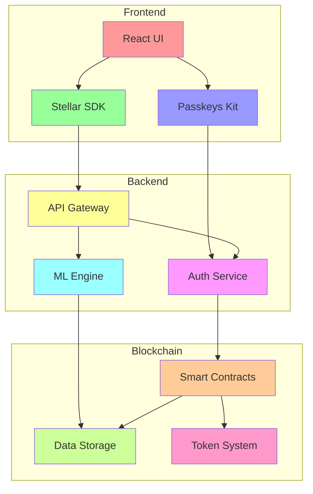
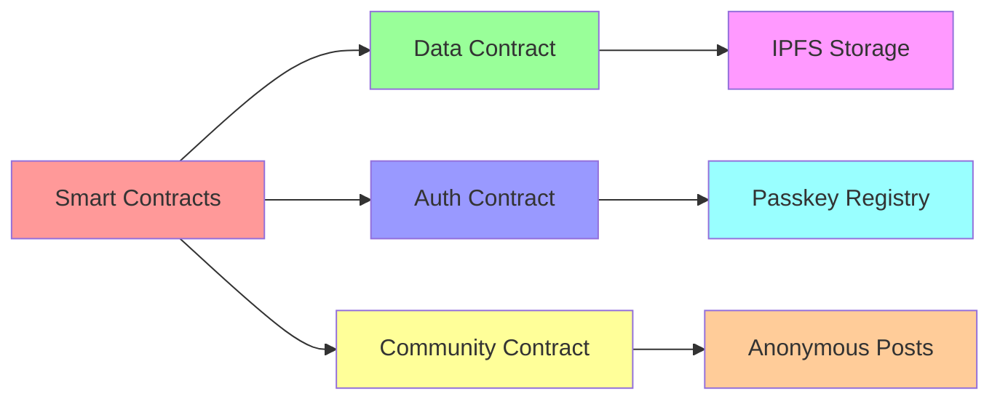
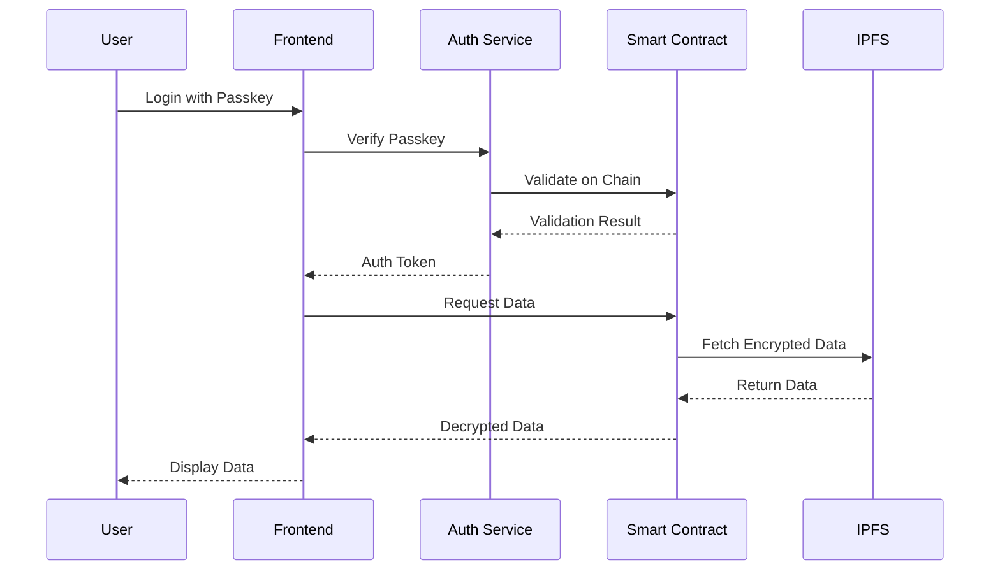
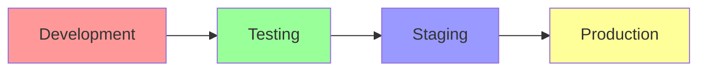

# 🏗 CycleBuddy Architecture

## System Overview

CycleBuddy is built on a privacy-first, decentralized architecture that leverages the Stellar blockchain for secure data storage and user authentication while maintaining a seamless Web2-like user experience.



## Core Components

### 1. Frontend Layer
- **React UI**: Built with Stellar Design System
- **Stellar SDK Integration**: Handles blockchain interactions
- **Passkeys Kit**: Provides seamless authentication
- **State Management**: Redux for local state
- **Offline Support**: PWA capabilities

### 2. Backend Services
- **API Gateway**: GraphQL-based API interface
- **Authentication Service**: Manages Stellar Passkeys
- **ML Engine**: Predictive analytics for cycle tracking
- **Caching Layer**: Redis for performance
- **Event Bus**: RabbitMQ for service communication

### 3. Blockchain Layer


#### Smart Contracts
1. **Data Contract**
   - Manages user data encryption
   - Handles IPFS integration
   - Controls access permissions

2. **Auth Contract**
   - Manages Passkey registration
   - Handles authentication flows
   - Controls user permissions

3. **Community Contract**
   - Manages anonymous posts
   - Handles content moderation
   - Controls community rewards

## Data Flow



## Security Architecture

### 1. Authentication Flow
- Passkey-based authentication
- No password storage
- Biometric security integration

### 2. Data Privacy
- End-to-end encryption
- Zero-knowledge proofs
- Decentralized storage

### 3. Access Control
- Role-based permissions
- Smart contract governance
- Multi-signature operations

## Scalability Considerations

### 1. Horizontal Scaling
- Microservices architecture
- Container orchestration
- Load balancing

### 2. Performance Optimization
- CDN integration
- Caching strategies
- Database sharding

### 3. Cost Optimization
- Efficient smart contract design
- Optimal storage patterns
- Resource pooling

## Development Environment

### Local Setup
```bash
├── frontend/           # React application
├── contracts/          # Stellar smart contracts
├── services/          # Backend microservices
├── libs/              # Shared libraries
└── tools/             # Development tools
```

### Deployment Pipeline


## Future Considerations

1. **Scalability**
   - Layer 2 solutions
   - Cross-chain integration
   - State channels

2. **Features**
   - AI-powered predictions
   - Social features
   - Educational content

3. **Integration**
   - Healthcare providers
   - Educational institutions
   - Research organizations

## Technical Decisions

### Why Stellar?
- Fast transaction speeds
- Low transaction costs
- Strong privacy features
- Robust smart contract support
- Active developer community

### Why Decentralized Storage?
- Enhanced privacy
- Data ownership
- Censorship resistance
- Global availability

### Why Passkeys?
- Enhanced security
- Better user experience
- No password management
- Industry standard

## Monitoring and Maintenance

1. **System Health**
   - Performance metrics
   - Error tracking
   - Usage analytics

2. **Security Monitoring**
   - Threat detection
   - Audit logging
   - Vulnerability scanning

3. **User Analytics**
   - Usage patterns
   - Feature adoption
   - User feedback

## Conclusion

This architecture is designed to provide a secure, scalable, and user-friendly platform for menstrual health tracking while leveraging the benefits of Web3 technology. The system prioritizes privacy, security, and user experience while maintaining the flexibility to evolve with user needs and technological advancements. 