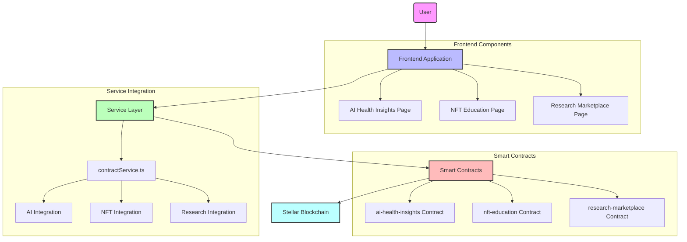
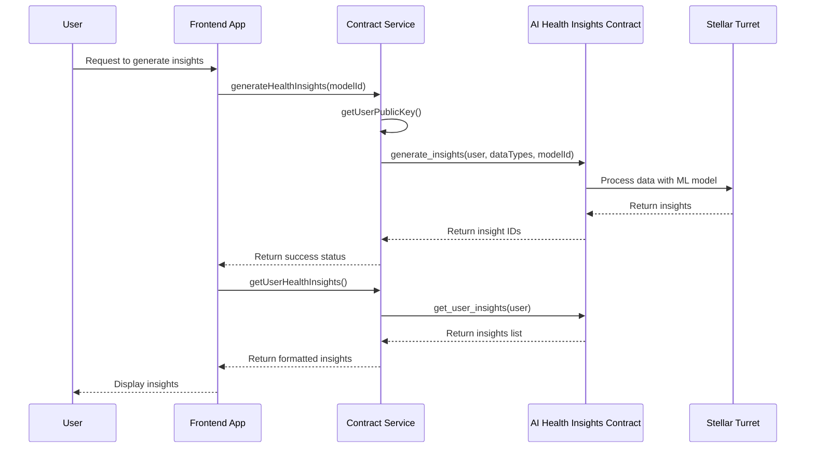
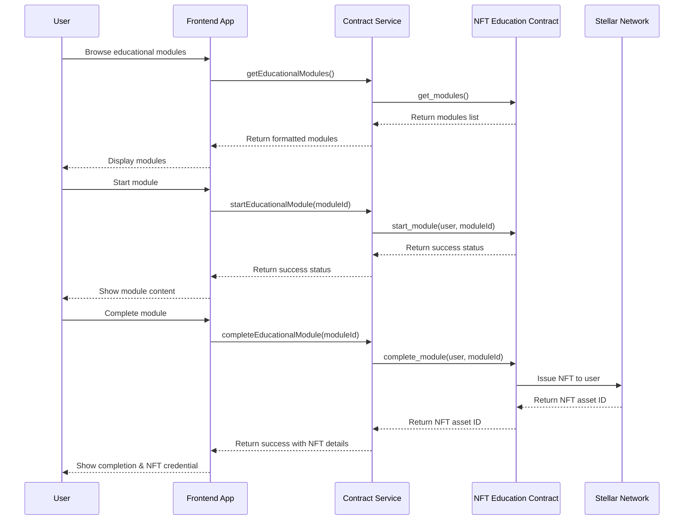
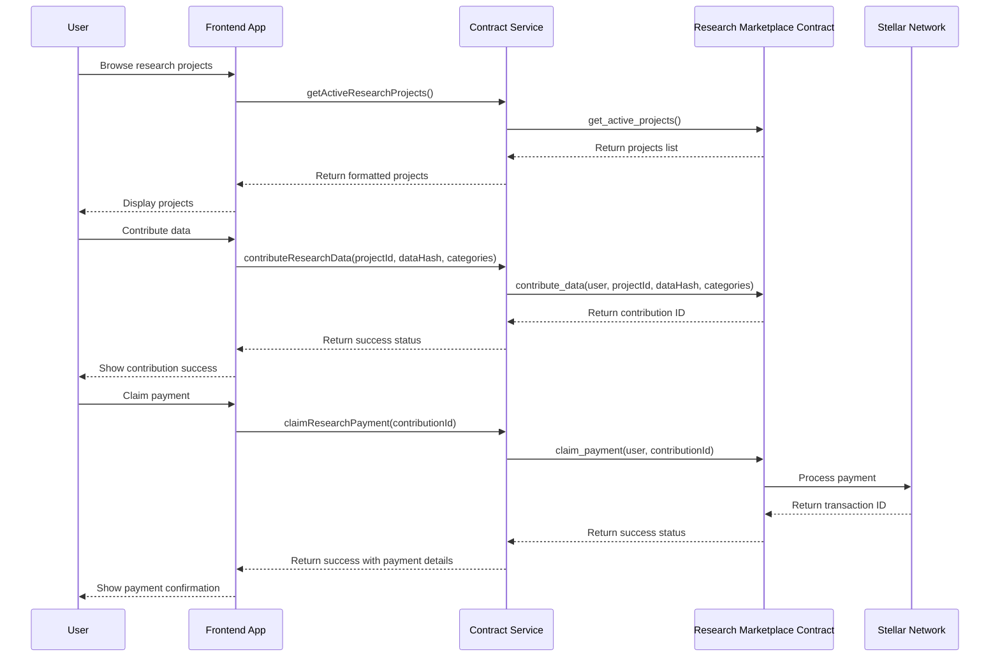
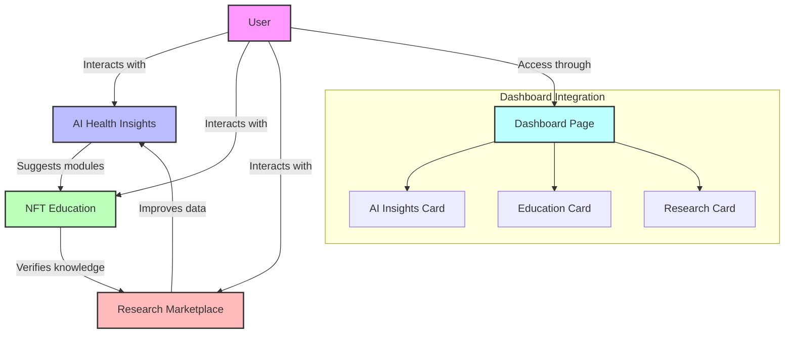
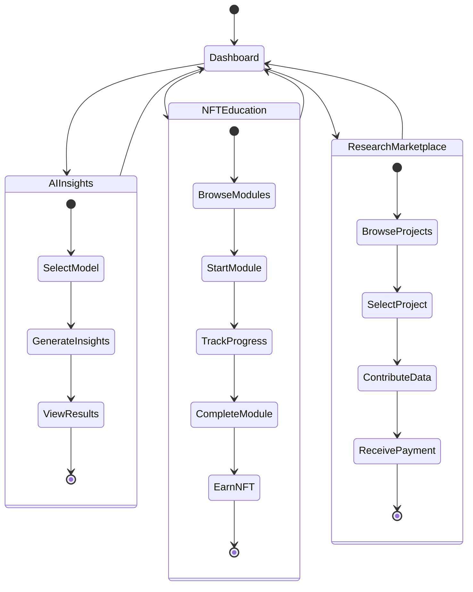
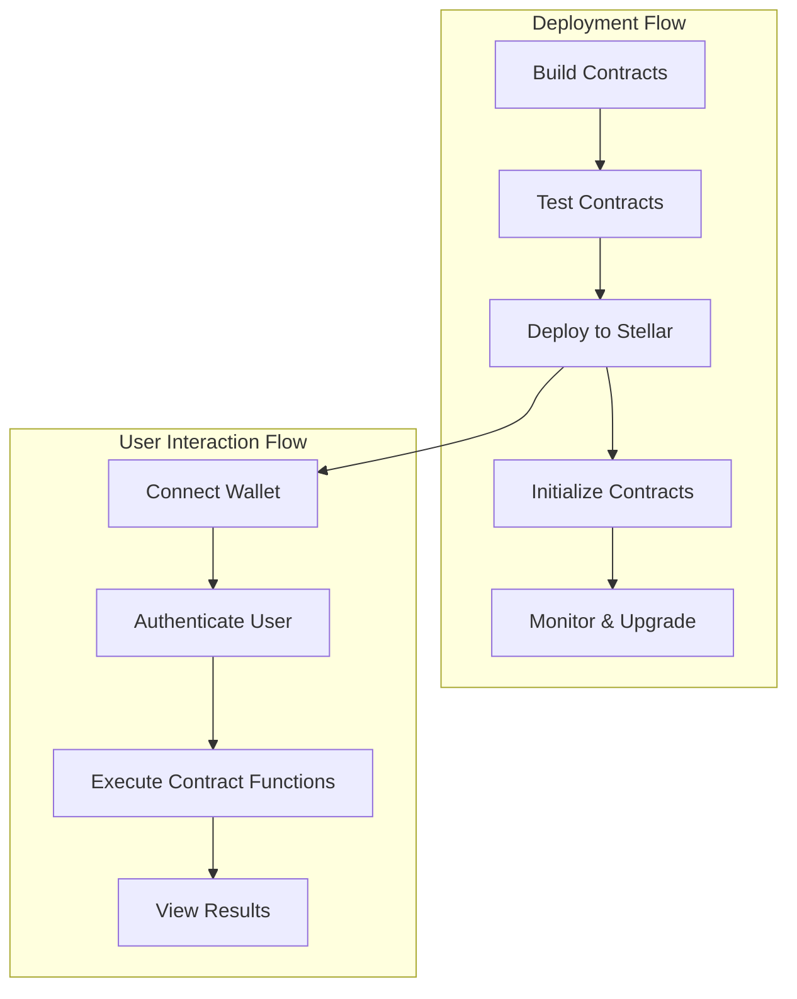

# 🚀 CycleBuddy Breakthrough Features Implementation

This document details the implementation of CycleBuddy's three breakthrough features that leverage Stellar's unique capabilities to create a revolutionary health platform.

## Implementation Architecture Overview

## 1. AI-Powered Health Insights Implementation

### Architecture

### Contract Implementation

The AI Health Insights contract (`contracts/ai-health-insights/src/lib.rs`) implements:

- Storage of AI models and their metadata
- Integration with Stellar Turrets for secure computation
- User permission management for health data access
- Insight generation from encrypted health data
- Verification pathways for medical validation

### Frontend Implementation

The AI Health Insights page (`src/pages/features/AIHealthInsightsPage.tsx`) provides:

- Model selection for different types of health analysis
- Visualization of generated insights with severity categorization
- Detailed insight exploration with recommendations
- Privacy-preserving tags showing data used in analysis

### Service Integration

The Contract Service (`src/services/stellar/contractService.ts`) implements:

- Method to generate insights: `generateHealthInsights(modelId)`
- Method to fetch available AI models: `getAvailableAIModels()`
- Method to retrieve user health insights: `getUserHealthInsights()`

## 2. NFT Education Implementation

### Architecture

### Contract Implementation

The NFT Education contract (`contracts/nft-education/src/lib.rs`) implements:

- Educational module management with metadata
- User progress tracking for modules
- NFT credential issuance upon completion
- Partner organization registration
- Benefit verification for NFT holders

### Frontend Implementation

The NFT Education page (`src/pages/features/NFTEducationPage.tsx`) provides:

- Module browsing with skill levels and prerequisites
- Progress tracking for enrolled modules
- Module completion and assessment
- NFT collection display
- Partner benefit discovery

### Service Integration

The Contract Service (`src/services/stellar/contractService.ts`) implements:

- Method to retrieve educational modules: `getEducationalModules()`
- Method to start a module: `startEducationalModule(moduleId)`
- Method to update progress: `updateModuleProgress(moduleId, progress, ...)`
- Method to complete a module: `completeEducationalModule(moduleId)`
- Method to get user's NFTs: `getUserNFTs()`

## 3. Research Marketplace Implementation

### Architecture

### Contract Implementation

The Research Marketplace contract (`contracts/research-marketplace/src/lib.rs`) implements:

- Research project management with ethical approval tracking
- Data contribution storage and quality assessment
- User reputation system
- Payment distribution for contributions
- Project statistics and user profiles

### Frontend Implementation

The Research Marketplace page (`src/pages/features/ResearchMarketplacePage.tsx`) provides:

- Research project discovery with ethical approval indicators
- Data contribution interface with privacy controls
- Contribution history and payment tracking
- Reputation score visualization
- Category preferences for contribution matching

### Service Integration

The Contract Service (`src/services/stellar/contractService.ts`) implements:

- Method to get active research projects: `getActiveResearchProjects()`
- Method to get user's research profile: `getUserResearchProfile()`
- Method to contribute data: `contributeResearchData(projectId, dataHash, categories)`
- Method to get user's contributions: `getUserResearchContributions()`
- Method to claim payments: `claimResearchPayment(contributionId)`

## Integration Points Between Features

The three breakthrough features are integrated to create a cohesive user experience:

### Integration Mechanisms

1. **AI Insights → Education**
   - Health insights generated by the AI can recommend specific educational modules to address knowledge gaps
   - The AI contract includes references to relevant module IDs in its insights

2. **Education → Research**
   - Completing educational modules increases user's reputation in the research marketplace
   - Higher education levels unlock more advanced research projects
   - The NFT contract notifies the research contract when users earn credentials

3. **Research → AI Insights**
   - Contributing quality data improves the training of AI models
   - The research contract includes data quality metrics that feed into the AI models

## Feature State Management Flow

## Technical Challenges and Solutions

### Privacy-Preserving Computation

**Challenge**: Performing machine learning analysis on health data while preserving user privacy.

**Solution**: Integration with Stellar Turrets to run secure computation on encrypted data without exposing raw user information.

### NFT Credential Management

**Challenge**: Creating verifiable educational credentials that are both private and transferable.

**Solution**: Custom NFT asset issuance through Stellar with metadata that can be selectively shared with healthcare providers.

### Decentralized Research Contributions

**Challenge**: Enabling anonymous data contributions while maintaining data quality and preventing fraud.

**Solution**: Reputation system with quality assessment algorithms that don't require personal identification.

## Deployment and Interaction

The features are deployed as Soroban smart contracts on the Stellar network and interact with the frontend through the contractService.ts interface.

This architecture ensures:
- Transparent contract execution
- User data sovereignty
- Privacy-by-design
- Interoperability with healthcare providers
- Scalable feature development 