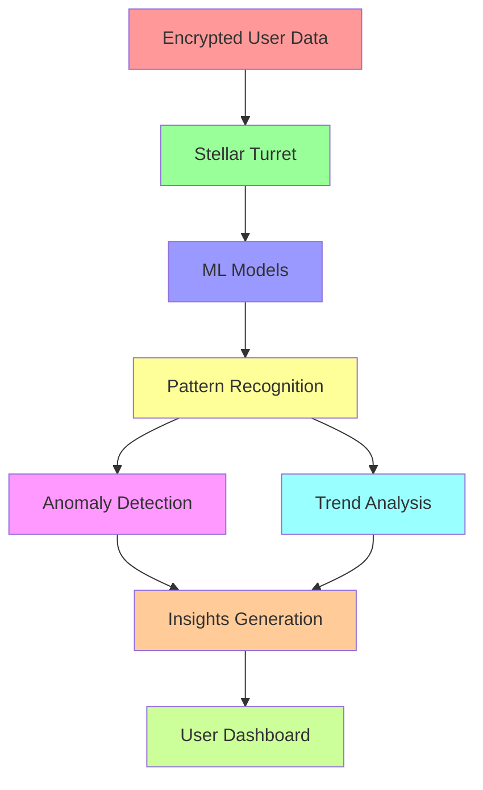
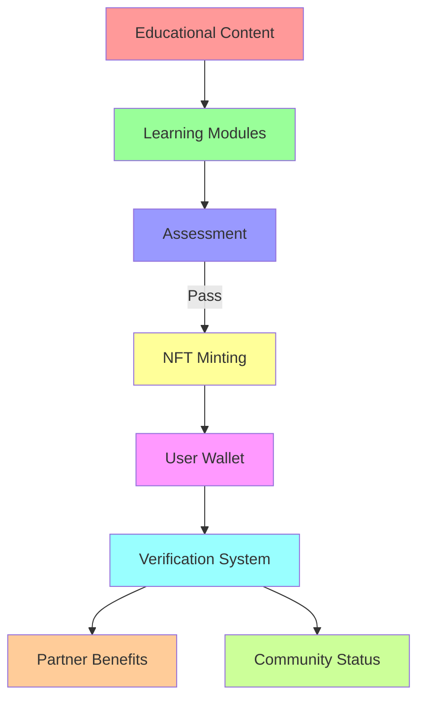
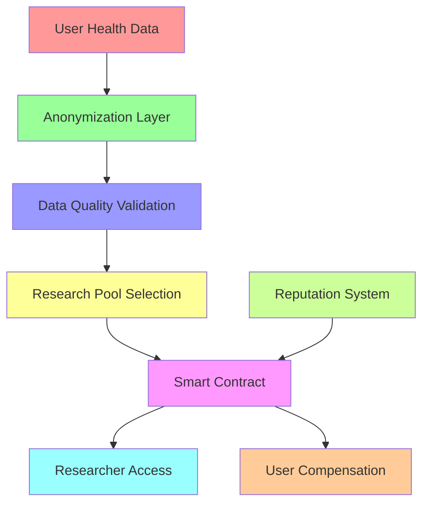

# 🚀 CycleBuddy Breakthrough Features

This document provides detailed specifications for the three breakthrough features that will transform CycleBuddy from an excellent health tracking app to a revolutionary platform that redefines how users interact with their health data.

## 1. AI-Powered Health Insights with Stellar Turrets

### Overview
Leveraging Stellar Turrets as secure computation providers, this feature enables advanced machine learning analysis on encrypted health data without compromising user privacy. The system generates personalized insights and potential early warnings for health concerns.

### Technical Architecture

### Key Components

#### 1. Secure Data Processing Pipeline
- **Homomorphic Encryption Integration**: Enables computation on encrypted data
- **Federated Learning Models**: Trains AI models across multiple users' data without centralizing the data
- **Differential Privacy**: Adds noise to outputs to prevent re-identification of individual users

#### 2. Machine Learning Models
- **Cycle Anomaly Detection**: Identifies irregular patterns that may indicate health issues
- **Symptom Correlation Engine**: Connects reported symptoms with potential causes
- **Personalized Prediction System**: Forecasts user's likely symptoms based on historical data
- **Population Comparison**: Contextualizes individual data within broader anonymized population statistics

#### 3. Insights Delivery System
- **Severity Classification**: Categorizes insights from informational to urgent
- **Verification Pathways**: Connects potentially serious insights to medical validation options
- **Explainable AI**: Provides clear reasoning behind each insight generated
- **Actionable Recommendations**: Suggests concrete steps users can take based on insights

### Implementation Plan

#### Phase 1: Foundation
- Set up Stellar Turret infrastructure with secure computation capabilities
- Implement basic encryption/decryption workflows
- Create data normalization and anonymization pipelines

#### Phase 2: Intelligence Layer
- Develop and validate initial ML models for pattern recognition
- Implement homomorphic encryption for secure computation
- Create federated learning system for model improvement without data sharing

#### Phase 3: User Experience
- Design intuitive visualization of complex health insights
- Implement personalized recommendation engine
- Develop alert system with appropriate urgency levels

#### Phase 4: Medical Integration
- Create verification pathways for connecting serious insights to healthcare providers
- Implement secure data sharing for validation
- Develop feedback loops to improve model accuracy based on validated outcomes

### Required APIs and Services
- **Stellar Turret API**: For secure distributed computation
- **Homomorphic Encryption Library**: Microsoft SEAL or similar
- **Machine Learning Framework**: TensorFlow or PyTorch with federated learning capabilities
- **Secure Storage**: IPFS or Stellar-based encrypted storage system
- **Medical Terminology API**: For translating technical findings into user-friendly language

## 2. NFT-Based Educational Achievement System

### Overview
A comprehensive health education platform where users earn verifiable Stellar-based NFTs for completing educational modules. These NFTs serve as credentials representing specific health knowledge and can unlock benefits from partner organizations.

### Technical Architecture

### Key Components

#### 1. Education Platform
- **Curriculum Design**: Age-appropriate, medically accurate content on menstrual and reproductive health
- **Interactive Learning**: Engaging formats including videos, quizzes, and interactive simulations
- **Progress Tracking**: Dashboard showing completed modules and available content
- **Personalized Learning Paths**: Content recommendations based on user's knowledge level and interests

#### 2. NFT Credential System
- **Achievement NFTs**: Unique tokens representing specific health knowledge areas
- **Metadata Standard**: Detailed information about knowledge demonstrated
- **Progressive Difficulty**: Tiered system from basic to advanced knowledge
- **Anti-Fraud Mechanism**: Prevents sharing of credentials through secure validation

#### 3. Partner Ecosystem
- **Verification Portal**: Allows third parties to verify NFT credentials with user permission
- **Benefits Marketplace**: Where partners can offer services to NFT holders
- **Integration APIs**: For partners to connect their systems to the verification platform
- **Impact Metrics**: Measuring how educational achievements translate to real-world outcomes

### Implementation Plan

#### Phase 1: Content Creation
- Develop core educational curriculum with medical experts
- Create engaging, accessible learning modules
- Build assessment system that verifies knowledge acquisition

#### Phase 2: NFT Infrastructure
- Implement Stellar-based NFT minting system
- Develop metadata schema for educational credentials
- Create secure wallet integration for NFT storage

#### Phase 3: Verification System
- Build credential verification portal
- Implement privacy-preserving verification protocols
- Create partner integration APIs

#### Phase 4: Partner Ecosystem
- Onboard healthcare providers and organizations
- Develop benefit fulfillment system
- Create analytics dashboard for measuring impact

### Required APIs and Services
- **Stellar Asset Issuance API**: For creating and managing NFTs
- **Content Management System**: For educational material
- **Assessment Engine**: For validating knowledge acquisition
- **Verification API**: For third-party validation of credentials
- **Partner Integration Framework**: For connecting with healthcare providers

## 3. Decentralized Research Contribution Marketplace

### Overview
A revolutionary platform where users can anonymously contribute their health data to research initiatives of their choosing and receive fair compensation through smart contracts. The system maintains user privacy while enabling valuable health research.

### Technical Architecture

### Key Components

#### 1. Data Contribution System
- **Granular Permissions**: Users select exactly what data to share and with whom
- **Anonymization Pipeline**: Multiple layers of data anonymization to prevent re-identification
- **Quality Assessment**: Automated validation of data completeness and consistency
- **Category Tagging**: Classification system to match data with relevant research

#### 2. Research Marketplace
- **Study Directory**: Searchable database of active research initiatives
- **Transparency Requirements**: Clear documentation of research goals and methods
- **Ethical Review Integration**: Verification of ethical approval for studies
- **Impact Tracking**: Showing how contributed data influences research outcomes

#### 3. Compensation Framework
- **Smart Contract Payments**: Automated disbursement when data meets quality criteria
- **Tiered Pricing Model**: Different rates based on data completeness and uniqueness
- **Reputation System**: Privacy-preserving scoring that increases earning potential
- **Withdrawal Options**: Multiple payment methods including direct-to-charity

### Implementation Plan

#### Phase 1: Data Infrastructure
- Build secure anonymization pipeline with multiple privacy layers
- Implement data quality validation system
- Create metadata tagging for research relevance

#### Phase 2: Marketplace Development
- Develop research initiative directory and search functionality
- Create study registration and verification process
- Build transparent documentation system

#### Phase 3: Smart Contract Integration
- Implement Stellar-based smart contracts for conditional payments
- Create reputation scoring algorithm
- Develop automated quality assessment for payment triggers

#### Phase 4: Impact Measurement
- Build research outcome tracking system
- Develop contributor dashboards showing impact
- Create feedback loop for continuous improvement

### Required APIs and Services
- **Stellar Smart Contract API**: For conditional payment distribution
- **Data Anonymization Tools**: For privacy-preserving data processing
- **Reputation System**: For measuring contributor reliability
- **Research Registry API**: For managing and categorizing studies
- **Impact Assessment Framework**: For tracking research outcomes

## Integration Points

The three breakthrough features are designed to work together, creating a powerful ecosystem that reinforces user engagement:

1. **Health Insights → Educational Content**: AI-detected patterns can trigger recommendations for specific educational modules
2. **Educational Achievements → Research Value**: More knowledgeable users tend to provide higher-quality research data
3. **Research Contributions → Better Insights**: More data improves the AI models, creating better insights

## Technical Requirements Summary

### Infrastructure Needs
- **Compute Resources**: Dedicated Stellar Turrets with ML capabilities
- **Storage**: Secure, encrypted distributed storage
- **Networking**: High-availability API infrastructure
- **Processing**: Batch processing for insights generation

### API Requirements
- **Stellar Integration**: Asset issuance, smart contracts, turrets
- **Machine Learning**: Model training, inference, and validation
- **Data Processing**: Anonymization, quality assessment, and transformation
- **Content Delivery**: Educational material serving and assessment

### Development Tools
- **Smart Contract Development**: Soroban SDK
- **Machine Learning Framework**: TensorFlow/PyTorch
- **Frontend**: React with visualization libraries
- **Backend**: Node.js with necessary ML bridges

## Success Metrics

### User Impact
- **Health Literacy**: Measurable improvement in health knowledge
- **Early Intervention**: Cases where health issues were addressed early due to insights
- **User Satisfaction**: Engagement and retention metrics

### Research Impact
- **Data Contributions**: Volume and quality of data contributed to research
- **Study Facilitation**: Number of studies accelerated through the platform
- **Scientific Publications**: Research papers published using platform data

### Business Impact
- **User Growth**: Acquisition and retention metrics
- **Research Partnerships**: Number and quality of research collaborations
- **Revenue Streams**: Sustainability through the research marketplace

## Conclusion

These breakthrough features transform CycleBuddy from a tracking tool into a comprehensive health platform that creates value for users, researchers, and healthcare providers. By leveraging Stellar's unique capabilities, we can build a solution that maintains the highest standards of privacy and security while delivering unprecedented functionality in the health tech space. 