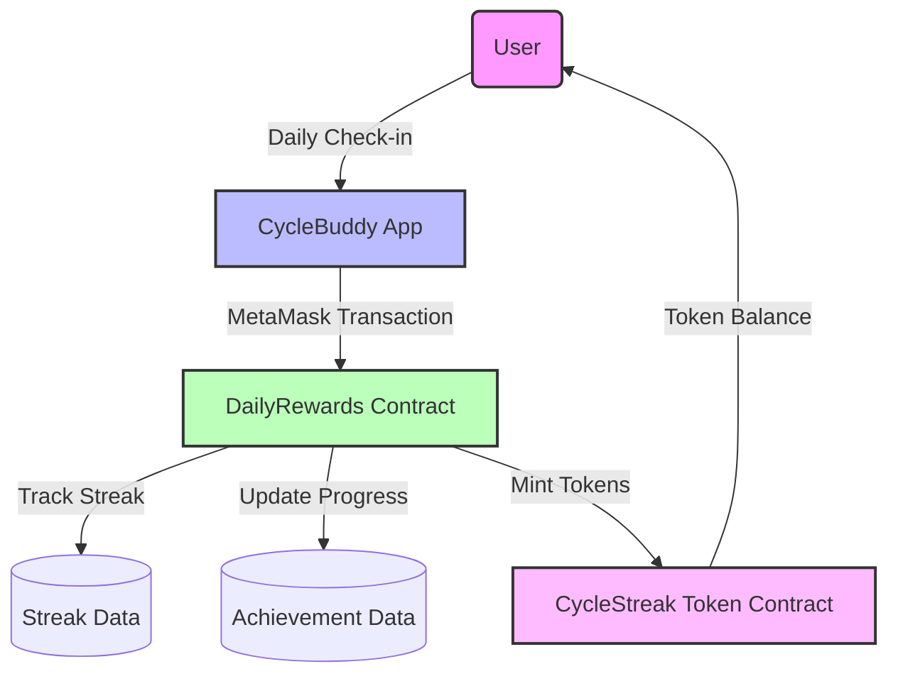

# Daily Rewards System

CycleBuddy's Daily Rewards System is an innovative feature built on the Bahamut blockchain that incentivizes consistent tracking of menstrual health data. This system rewards users with CycleStreak tokens (CSTRK) for maintaining daily check-ins and achieving various milestones.

## Table of Contents
- [Overview](#overview)
- [Technical Architecture](#technical-architecture)
- [Smart Contracts](#smart-contracts)
- [User Flow](#user-flow)
- [Rewards & Achievements](#rewards--achievements)
- [Integration](#integration)
- [Deployment](#deployment)
- [Security Considerations](#security-considerations)

## Overview

The Daily Rewards System uses Bahamut's Proof-of-Staked-Authority (PoSA) consensus mechanism to provide a fast, user-friendly experience with near-instant reward confirmation. By leveraging blockchain technology, we ensure that users have true ownership of their rewards and achievements.

### Key Benefits

- **Incentivizes Consistency**: Encourages regular tracking of health data
- **Transparent Reward System**: All rules and rewards are publicly verifiable on the blockchain
- **User Ownership**: Users fully own their tokens and achievements
- **Fast Transactions**: ~2 second block times for immediate feedback
- **Achievement-Based**: Various milestones unlock additional rewards

## Technical Architecture

The Daily Rewards System consists of two primary Solidity smart contracts deployed on the Bahamut blockchain:

1. **CycleStreakToken**: An ERC-20 token contract that manages the CSTRK token
2. **DailyRewards**: The main contract handling check-ins, streaks, achievements, and reward distribution

This system integrates with the CycleBuddy frontend through a MetaMask connection.



## Smart Contracts

### CycleStreakToken (CSTRK)

The CycleStreakToken is an ERC-20 token with the following features:

- **Standard ERC-20 Functions**: Transfer, balance checking, etc.
- **Authorized Minting**: Only authorized minters (like the DailyRewards contract) can create new tokens
- **Owner Controls**: Contract owner can add/remove minters
- **Burnable**: Tokens can be burned if needed

### DailyRewards Contract

The DailyRewards contract manages the daily check-in system and achievements:

- **Daily Check-in**: Users can check in once per day to maintain their streak
- **Streak Tracking**: Monitors consecutive days of check-ins
- **Achievement System**: Tracks progress toward various milestones
- **Reward Distribution**: Mints and distributes CSTRK tokens based on activity
- **Configurable Parameters**: Adjustable time intervals and reward amounts

### Key Functions

| Function | Description |
|----------|-------------|
| `dailyCheckIn()` | Record a daily check-in and earn rewards |
| `claimReward(bytes32 rewardId)` | Claim a reward for a completed achievement |
| `getUserStreak(address user)` | Get a user's current streak information |
| `getUserAchievements()` | Get all achievements and user's progress |
| `getClaimableRewards()` | Get rewards available to claim |

## User Flow

1. **Connection**: User connects their MetaMask wallet to the app
2. **Daily Check-in**: User performs a daily check-in transaction
3. **Streak Building**: Consecutive check-ins build a streak
4. **Achievement Unlocking**: Various milestones are reached based on activity
5. **Reward Claiming**: User claims rewards for completed achievements
6. **Token Usage**: CSTRK tokens can be held or used within the ecosystem

## Rewards & Achievements

### Daily Check-in Rewards

- **Base Reward**: 10 CSTRK for each daily check-in
- **Streak Bonus**: Additional percentage based on streak length
  - +1% bonus for each completed week of streak
  - Example: 30-day streak = +4% bonus (10.4 CSTRK per check-in)

### Achievement Rewards

| Achievement | Description | Reward |
|-------------|-------------|--------|
| First Entry | Record first cycle entry | 10 CSTRK |
| Week Warrior | Track consistently for 7 days | 20 CSTRK |
| Monthly Master | Track consistently for 30 days | 50 CSTRK |
| Cycle Champion | Track consistently for 90 days | 100 CSTRK |
| Knowledge Seeker | Complete basic educational course | 30 CSTRK |
| Community Member | Join the CycleBuddy community | 15 CSTRK |

## Integration

The Daily Rewards System integrates with the CycleBuddy application through:

1. **BahamutContractService**: A TypeScript service that interacts with the smart contracts
2. **RewardsModal Component**: UI for displaying streaks, achievements, and rewards
3. **MetaMask Integration**: For signing transactions and connecting to Bahamut blockchain

### Frontend Integration Example

```typescript
// Example of daily check-in
async function performDailyCheckIn() {
  try {
    const success = await bahamutContractService.dailyCheckIn();
    if (success) {
      // Update UI to show success
    }
  } catch (error) {
    // Handle error
  }
}
```

## Deployment

Deploying the Daily Rewards System involves:

1. Deploying the CycleStreakToken contract
2. Deploying the DailyRewards contract with the token address
3. Adding the DailyRewards contract as an authorized minter for the token

### Deployment Commands

```bash
# Compile contracts
npm run bahamut:compile

# Run tests
npm run bahamut:test

# Deploy to testnet
npm run bahamut:deploy:testnet

# Deploy to mainnet
npm run bahamut:deploy:mainnet

# Verify contracts on explorer
npm run bahamut:verify
```

## Security Considerations

The Daily Rewards System incorporates several security features:

- **Reentrancy Protection**: Guards against reentrancy attacks
- **Access Controls**: Only authorized contracts can mint tokens
- **Rate Limiting**: Minimum time between check-ins prevents abuse
- **Non-Custodial**: Users always control their tokens
- **Transparent Rules**: All reward logic is public and immutable

### Security Best Practices

- Regular security audits
- Rate limiting to prevent abuse
- Clean separation of concerns between contracts
- Proper error handling and input validation
- Extensive test coverage for all contract functions 