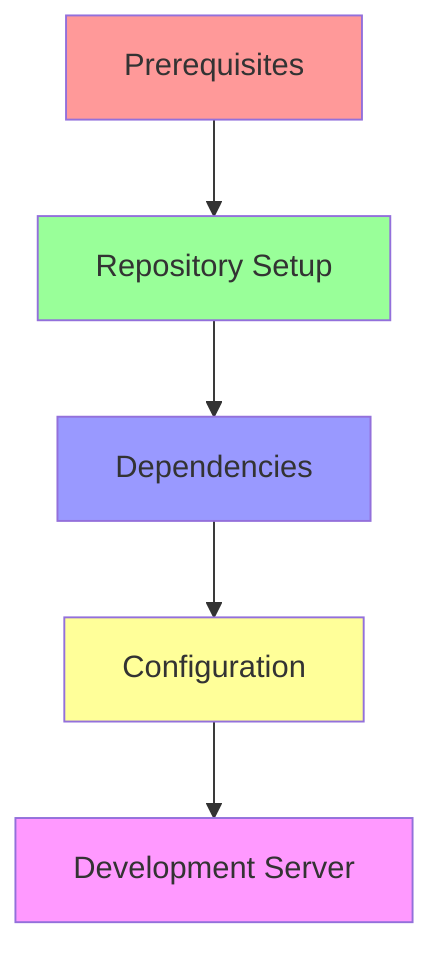
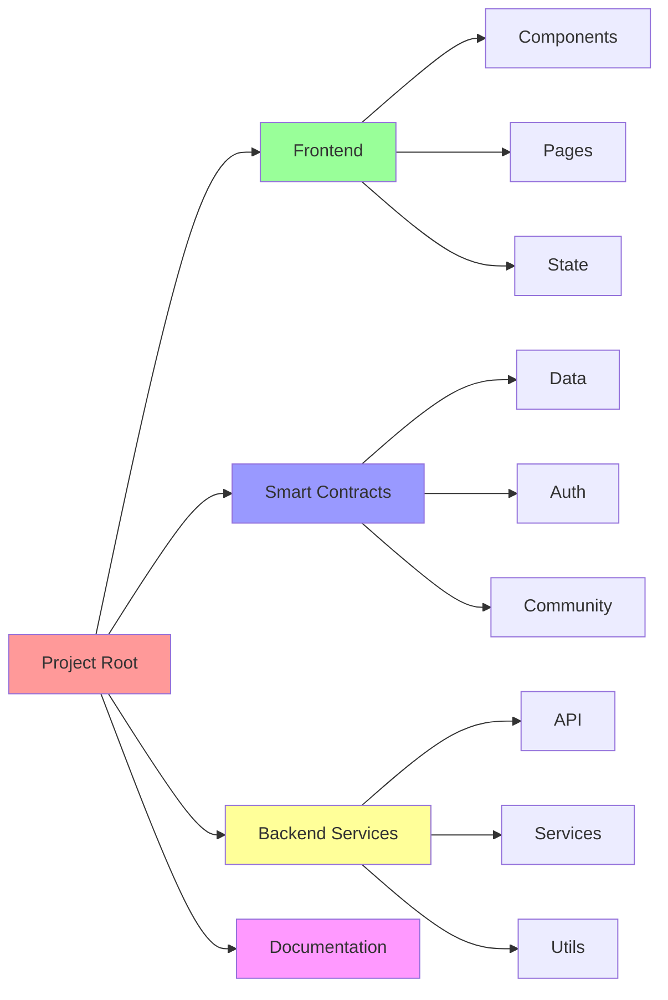
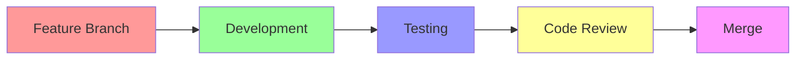
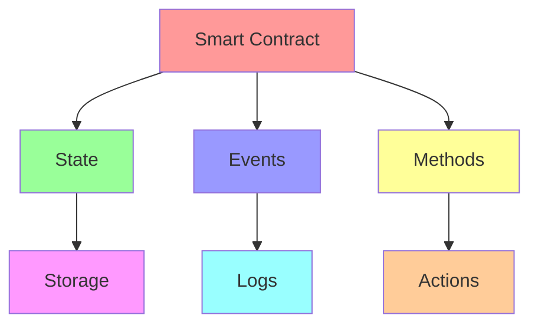
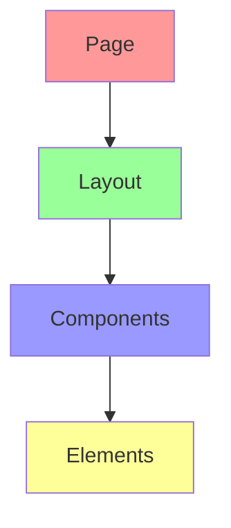
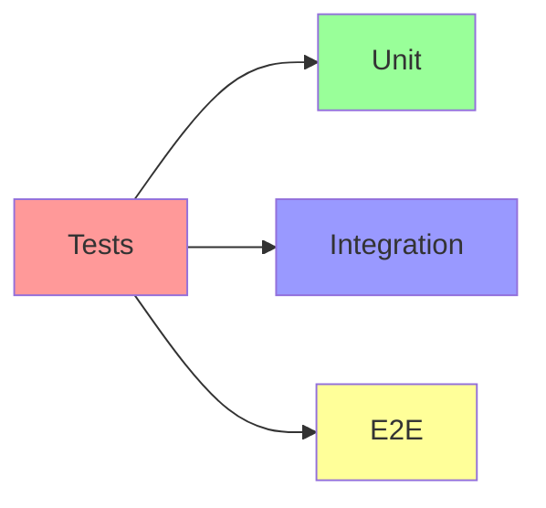
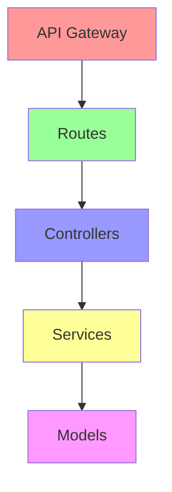
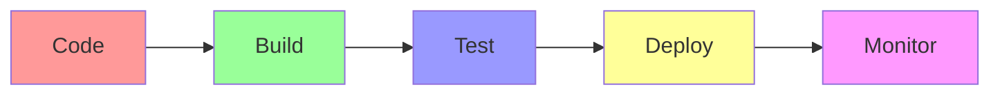

# 👩‍💻 CycleBuddy Development Guide

## Overview

This guide provides comprehensive information for developers who want to contribute to CycleBuddy. We use modern development practices and tools to ensure code quality and maintainability.

## Development Environment Setup



### Prerequisites
```bash
# Required tools
node >= 18.0.0
npm >= 9.0.0
rust >= 1.70.0
docker >= 24.0.0
```

### Getting Started
```bash
# Clone the repository
git clone https://github.com/yourusername/cyclebuddy-stellar

# Install dependencies
npm install

# Set up environment
cp .env.example .env

# Start development server
npm run dev
```

## Project Structure



### Directory Structure
```
cyclebuddy-stellar/
├── frontend/
│   ├── components/
│   ├── pages/
│   ├── state/
│   └── utils/
├── contracts/
│   ├── data/
│   ├── auth/
│   └── community/
├── services/
│   ├── api/
│   ├── ml/
│   └── utils/
└── docs/
    ├── architecture.md
    ├── security.md
    └── api.md
```

## Development Workflow



### Git Workflow
1. **Branch Naming**
   ```bash
   feature/description
   bugfix/description
   hotfix/description
   ```

2. **Commit Messages**
   ```bash
   feat: add new feature
   fix: resolve bug
   docs: update documentation
   style: format code
   refactor: restructure code
   test: add tests
   ```

3. **Pull Requests**
   - Use PR template
   - Include tests
   - Update documentation
   - Add screenshots

## Smart Contract Development

### Contract Structure


### Development Process
1. **Writing Contracts**
   ```rust
   #[contract]
   pub struct DataContract {
       data: Storage,
       owner: Address,
   }

   #[contractimpl]
   impl DataContract {
       pub fn store_data(&mut self, data: Vec<u8>) -> Result<(), Error> {
           // Implementation
       }
   }
   ```

2. **Testing**
   ```rust
   #[cfg(test)]
   mod tests {
       #[test]
       fn test_store_data() {
           // Test implementation
       }
   }
   ```

3. **Deployment**
   ```bash
   # Build contract
   cargo build --target wasm32-unknown-unknown

   # Deploy to testnet
   stellar-cli deploy contract.wasm
   ```

## Frontend Development

### Component Structure


### Example Component
```typescript
import React from 'react';
import { usePasskey } from '@stellar/passkey-kit';

interface Props {
  onAuth: (token: string) => void;
}

export const AuthComponent: React.FC<Props> = ({ onAuth }) => {
  const passkey = usePasskey();
  
  const handleAuth = async () => {
    const token = await passkey.authenticate();
    onAuth(token);
  };
  
  return (
    <button onClick={handleAuth}>
      Authenticate
    </button>
  );
};
```

## Testing

### Test Structure


### Running Tests
```bash
# Unit tests
npm run test:unit

# Integration tests
npm run test:integration

# E2E tests
npm run test:e2e

# All tests
npm test
```

## API Development

### API Structure


### Example Endpoint
```typescript
import { Router } from 'express';
import { authenticate } from '../middleware/auth';

const router = Router();

router.post('/data', authenticate, async (req, res) => {
  try {
    // Implementation
  } catch (error) {
    res.status(500).json({ error });
  }
});
```

## Deployment

### Pipeline


### Deployment Process
```bash
# Build application
npm run build

# Run tests
npm test

# Deploy to staging
npm run deploy:staging

# Deploy to production
npm run deploy:prod
```

## Best Practices

### 1. Code Style
- Follow ESLint configuration
- Use TypeScript
- Write meaningful comments
- Keep functions small

### 2. Testing
- Write unit tests
- Add integration tests
- Include E2E tests
- Maintain test coverage

### 3. Documentation
- Update README
- Document APIs
- Add JSDoc comments
- Keep docs current

## Troubleshooting

### Common Issues
1. **Build Failures**
   ```bash
   # Clear cache
   npm run clean
   
   # Reinstall dependencies
   npm ci
   ```

2. **Test Failures**
   ```bash
   # Run specific test
   npm test -- -t "test name"
   
   # Update snapshots
   npm test -- -u
   ```

3. **Contract Deployment**
   ```bash
   # Check network
   stellar-cli network status
   
   # Verify account
   stellar-cli account info
   ```

## Resources

### Documentation
- [Stellar Docs](https://developers.stellar.org/)
- [React Docs](https://reactjs.org/)
- [TypeScript Docs](https://www.typescriptlang.org/)

### Tools
- [Stellar CLI](https://www.stellar.org/developers/guides/tools/stellar-cli.html)
- [Passkey Kit](https://github.com/stellar/passkey-kit)
- [Stellar SDK](https://www.stellar.org/developers/js-stellar-sdk/reference/)

## Support

For development support:
- Create an issue
- Join Discord channel
- Email: dev@cyclebuddy.com

## Contributing

1. Fork repository
2. Create feature branch
3. Commit changes
4. Create pull request
5. Wait for review

Remember to:
- Follow code style
- Add tests
- Update documentation
- Keep changes focused 