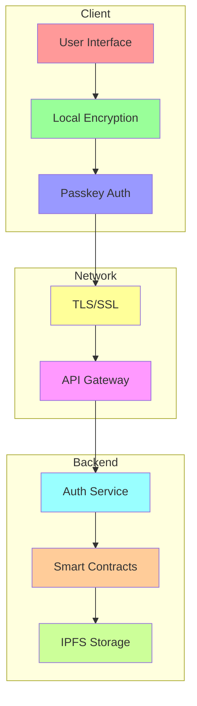
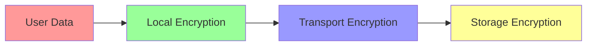
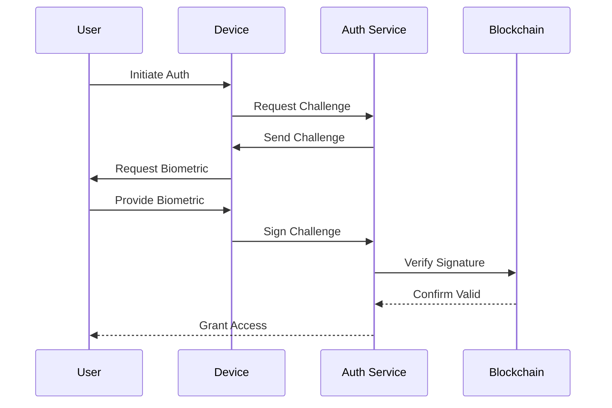
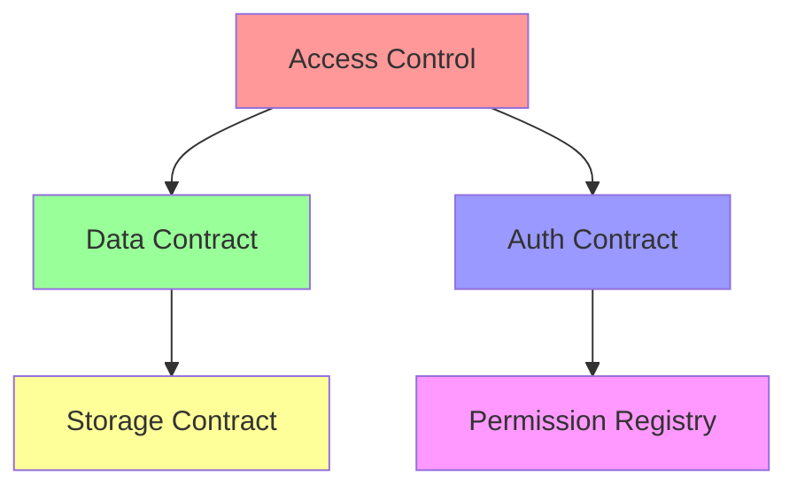
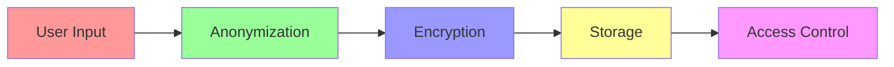
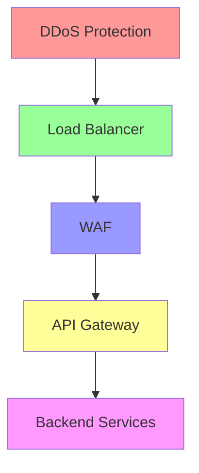
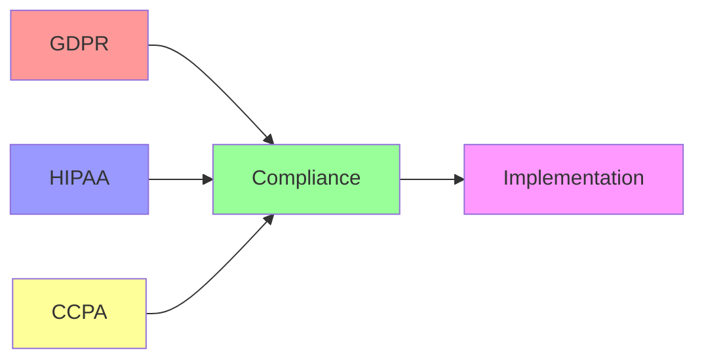
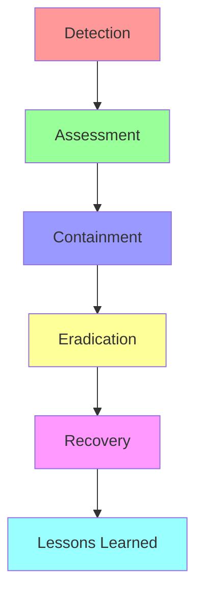

# 🔒 CycleBuddy Security Model

## Overview

CycleBuddy's security model is built on the principle of "Privacy by Design," ensuring that user data is protected at every level of the application. Our implementation leverages the security features of the Stellar blockchain while maintaining a user-friendly experience.

## Security Architecture

## 1. Data Protection

### Encryption Layers

1. **Local Layer**
   - AES-256 encryption
   - Secure enclave storage
   - Zero-knowledge architecture

2. **Transport Layer**
   - TLS 1.3
   - Certificate pinning
   - Perfect forward secrecy

3. **Storage Layer**
   - Encrypted IPFS storage
   - Blockchain-based access control
   - Distributed storage system

## 2. Authentication System

### Passkey Implementation

1. **Passkey Features**
   - Biometric authentication
   - Device-bound keys
   - No password storage

2. **Security Measures**
   - Rate limiting
   - Anomaly detection
   - Multi-device support

3. **Recovery Process**
   - Secure backup system
   - Recovery keys
   - Guardian system

## 3. Smart Contract Security

### Contract Architecture

1. **Access Control**
   - Role-based permissions
   - Time-based restrictions
   - Multi-signature requirements

2. **Audit Measures**
   - Automated testing
   - External audits
   - Bug bounty program

3. **Upgrade Protocol**
   - Transparent updates
   - Grace periods
   - Emergency procedures

## 4. Privacy Protections

### Data Flow Security

1. **Data Minimization**
   - Essential collection only
   - Automatic deletion
   - Data expiration

2. **Anonymization**
   - Data masking
   - Aggregation
   - Pseudonymization

3. **Access Controls**
   - Granular permissions
   - Audit logging
   - Time-based access

## 5. Network Security

### Infrastructure Protection

1. **DDoS Mitigation**
   - Rate limiting
   - Traffic filtering
   - Load distribution

2. **Firewall Rules**
   - Request validation
   - IP blocking
   - Pattern matching

3. **Monitoring**
   - Real-time alerts
   - Log analysis
   - Performance metrics

## 6. Compliance & Standards

### Regulatory Framework

1. **Data Protection**
   - GDPR compliance
   - HIPAA standards
   - CCPA requirements

2. **User Rights**
   - Data portability
   - Right to erasure
   - Access controls

3. **Documentation**
   - Policy documents
   - Audit trails
   - Compliance reports

## 7. Incident Response

### Response Protocol

1. **Detection**
   - Automated monitoring
   - User reports
   - System alerts

2. **Response**
   - Immediate action
   - Communication plan
   - Recovery procedures

3. **Prevention**
   - Regular updates
   - Security training
   - System hardening

## Best Practices

1. **Development**
   - Secure coding standards
   - Code review process
   - Security testing

2. **Operations**
   - Regular audits
   - Update management
   - Access reviews

3. **Training**
   - Security awareness
   - Incident response
   - Compliance training

## Security Roadmap

1. **Short-term**
   - Regular security audits
   - Penetration testing
   - Vulnerability assessments

2. **Medium-term**
   - Enhanced encryption
   - Advanced monitoring
   - Additional compliance

3. **Long-term**
   - AI-powered security
   - Quantum resistance
   - Zero-trust architecture

## Emergency Contacts

- **Security Team**: security@cyclebuddy.com
- **Support**: support@cyclebuddy.com
- **Emergency**: emergency@cyclebuddy.com

## Conclusion

Our security model is designed to provide maximum protection while maintaining usability. We continuously monitor, update, and improve our security measures to stay ahead of potential threats and protect our users' sensitive data. 