# 📝 CycleBuddy Smart Contracts

## Overview

CycleBuddy's smart contracts are built on the Stellar blockchain, providing secure, private, and efficient data management for user information and community interactions.

## Contract Architecture

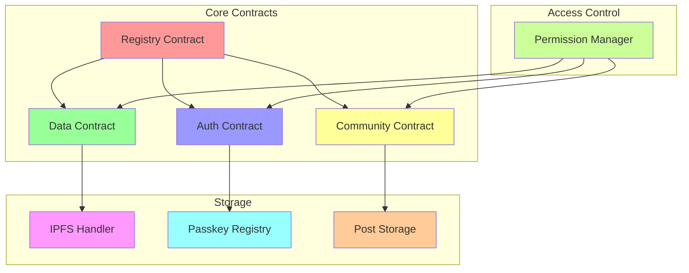

## Contract Components

### 1. Registry Contract

```rust
#[contract]
pub struct RegistryContract {
    owner: Address,
    contracts: Map<ContractType, Address>,
    admins: Vec<Address>,
}

#[contractimpl]
impl RegistryContract {
    pub fn register_contract(&mut self, contract_type: ContractType, address: Address) -> Result<(), Error> {
        // Implementation
    }
    
    pub fn get_contract(&self, contract_type: ContractType) -> Option<Address> {
        // Implementation
    }
}
```

### 2. Data Contract

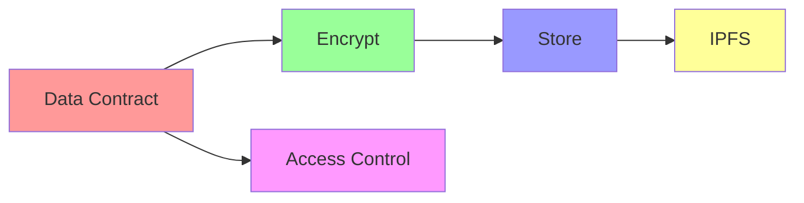

```rust
#[contract]
pub struct DataContract {
    owner: Address,
    data_store: Map<Address, Vec<EncryptedData>>,
    permissions: Map<Address, AccessLevel>,
}

#[contractimpl]
impl DataContract {
    pub fn store_data(&mut self, data: Vec<u8>) -> Result<(), Error> {
        // Implementation
    }
    
    pub fn retrieve_data(&self, user: Address) -> Result<Vec<u8>, Error> {
        // Implementation
    }
}
```

### 3. Auth Contract

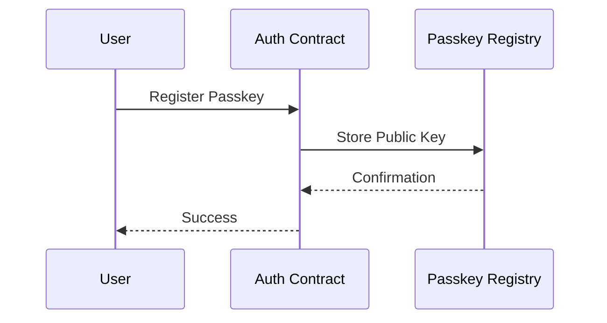

```rust
#[contract]
pub struct AuthContract {
    passkeys: Map<Address, PublicKey>,
    nonces: Map<Address, u64>,
    recovery_keys: Map<Address, Vec<Address>>,
}

#[contractimpl]
impl AuthContract {
    pub fn register_passkey(&mut self, public_key: PublicKey) -> Result<(), Error> {
        // Implementation
    }
    
    pub fn verify_signature(&self, signature: Signature, message: Vec<u8>) -> bool {
        // Implementation
    }
}
```

### 4. Community Contract

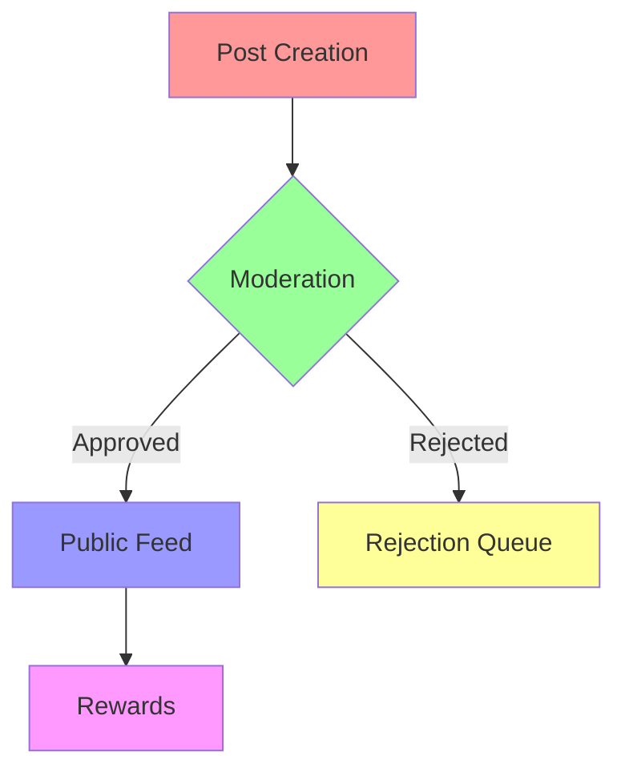

```rust
#[contract]
pub struct CommunityContract {
    posts: Map<PostId, Post>,
    moderators: Vec<Address>,
    rewards: Map<Address, Balance>,
}

#[contractimpl]
impl CommunityContract {
    pub fn create_post(&mut self, content: Vec<u8>) -> Result<PostId, Error> {
        // Implementation
    }
    
    pub fn moderate_post(&mut self, post_id: PostId, decision: Decision) -> Result<(), Error> {
        // Implementation
    }
}
```

## Data Structures

### 1. User Data

```rust
#[derive(Serialize, Deserialize)]
pub struct CycleData {
    timestamp: u64,
    symptoms: Vec<Symptom>,
    mood: Mood,
    notes: Option<String>,
    metadata: Metadata,
}

#[derive(Serialize, Deserialize)]
pub struct EncryptedData {
    data: Vec<u8>,
    public_key: PublicKey,
    nonce: [u8; 24],
}
```

### 2. Access Control

```rust
#[derive(Serialize, Deserialize)]
pub enum AccessLevel {
    Owner,
    ReadWrite,
    ReadOnly,
    None,
}

#[derive(Serialize, Deserialize)]
pub struct Permission {
    user: Address,
    level: AccessLevel,
    expiry: Option<u64>,
}
```

## Security Features

### 1. Encryption

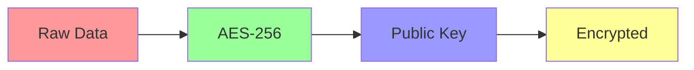

### 2. Access Control

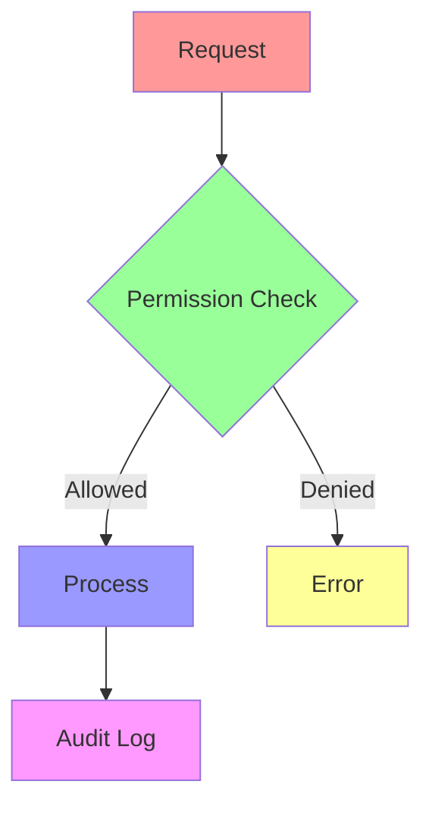

## Contract Deployment

### 1. Testnet Deployment

```bash
# Build contracts
cargo build --target wasm32-unknown-unknown --release

# Deploy to testnet
stellar-cli deploy \
    --network testnet \
    --contract registry.wasm \
    --signer admin.key
```

### 2. Mainnet Deployment

```bash
# Security audit
cargo audit

# Deploy to mainnet
stellar-cli deploy \
    --network mainnet \
    --contract registry.wasm \
    --signer production.key
```

## Testing

### 1. Unit Tests

```rust
#[cfg(test)]
mod tests {
    use super::*;
    
    #[test]
    fn test_data_storage() {
        // Test implementation
    }
    
    #[test]
    fn test_access_control() {
        // Test implementation
    }
}
```

### 2. Integration Tests

```rust
#[cfg(test)]
mod integration_tests {
    #[test]
    fn test_contract_interaction() {
        // Test implementation
    }
}
```

## Contract Upgrades

### Upgrade Process

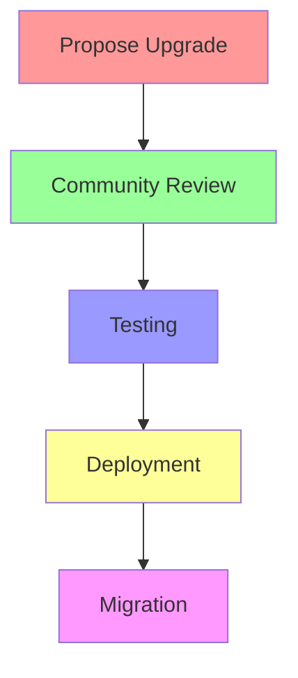

### Migration

```rust
pub trait Migratable {
    fn migrate(&mut self) -> Result<(), Error>;
}

impl Migratable for DataContract {
    fn migrate(&mut self) -> Result<(), Error> {
        // Migration implementation
    }
}
```

## Error Handling

### Error Types

```rust
#[derive(Debug)]
pub enum ContractError {
    Unauthorized,
    InvalidInput,
    StorageError,
    NetworkError,
    // Other error types
}

impl From<ContractError> for Error {
    fn from(error: ContractError) -> Self {
        // Implementation
    }
}
```

## Events

### Event Types

```rust
#[derive(Serialize)]
pub enum ContractEvent {
    DataStored {
        user: Address,
        timestamp: u64,
    },
    AccessGranted {
        from: Address,
        to: Address,
        level: AccessLevel,
    },
    PostCreated {
        id: PostId,
        author: Address,
    },
}
```

## Advanced Stellar Features

### 1. Path Payments for Donations

The donation system leverages Stellar's path payment feature to allow users to donate to health initiatives in any currency, which is automatically converted to the recipient's preferred currency.

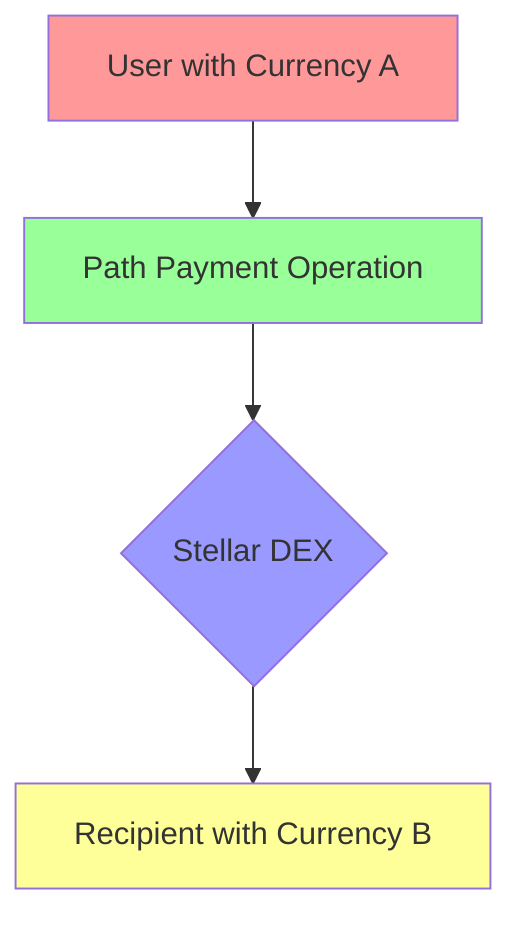

```rust
#[contract]
pub struct DonationContract {
    initiatives: Map<InitiativeId, Initiative>,
    donations: Map<Address, Vec<Donation>>,
    total_donated: Map<InitiativeId, Amount>,
}

#[contractimpl]
impl DonationContract {
    pub fn donate_with_path_payment(&self, 
        from_asset: Asset, 
        to_asset: Asset,
        initiative_id: InitiativeId, 
        amount: Amount
    ) -> Result<(), Error> {
        // Create a path payment operation that converts from_asset to to_asset
        // Record donation details
        // Update initiative statistics
    }
    
    pub fn get_donation_history(&self, user: Address) -> Vec<Donation> {
        // Return donation history for user
    }
}
```

### 2. Time-bound Multi-signature Data Sharing

This feature enables secure, time-limited sharing of health data with medical professionals using Stellar's multi-signature capabilities.

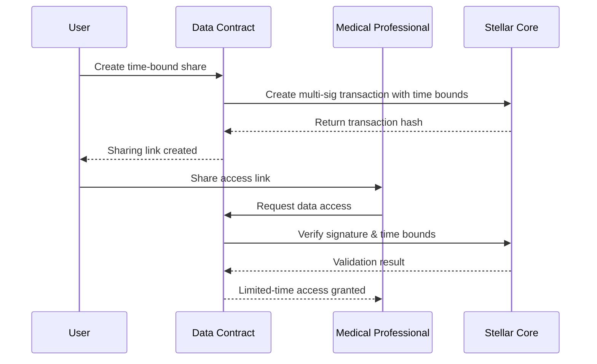

```rust
#[derive(Serialize, Deserialize)]
pub struct DataShareConfig {
    recipient: Address,
    data_ids: Vec<DataId>,
    start_time: u64,
    end_time: u64,
    access_level: AccessLevel,
}

#[contractimpl]
impl DataContract {
    pub fn create_time_bound_share(&mut self, 
        config: DataShareConfig
    ) -> Result<String, Error> {
        // Create multi-signature transaction with time bounds
        // Store share configuration
        // Return sharing link/identifier
    }
    
    pub fn access_shared_data(&self, 
        share_id: String, 
        signature: Signature
    ) -> Result<Vec<EncryptedData>, Error> {
        // Verify time bounds are still valid
        // Verify signature from authorized recipient
        // Return requested data if authorized
    }
}
```

### 3. Claimable Balances for Rewards

Implements a reward system using Stellar's claimable balances, providing incentives for consistent tracking and educational achievements.

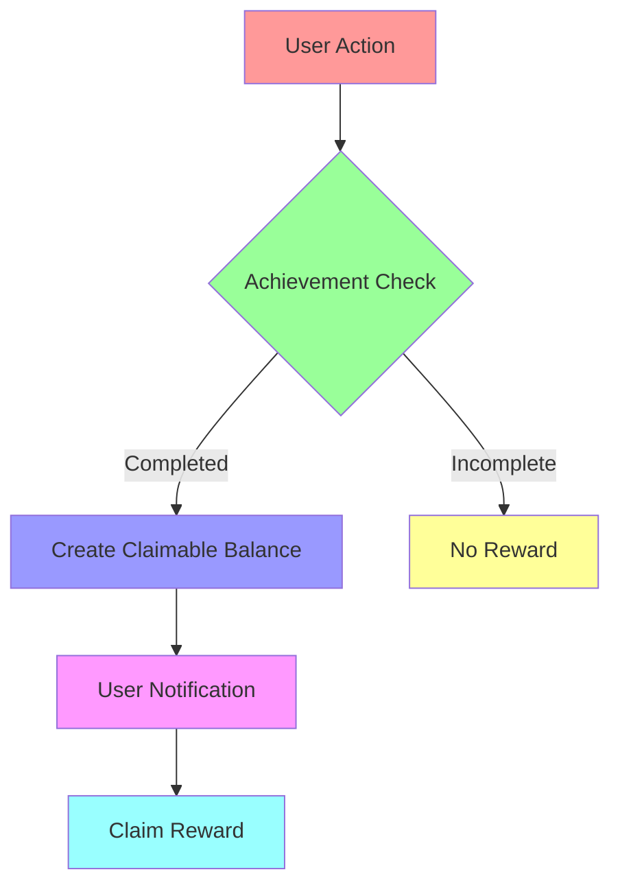

```rust
#[contract]
pub struct RewardContract {
    achievements: Map<AchievementId, Achievement>,
    user_progress: Map<Address, Map<AchievementId, Progress>>,
    claimable_rewards: Map<Address, Vec<ClaimableReward>>,
}

#[contractimpl]
impl RewardContract {
    pub fn check_and_create_rewards(&mut self, user: Address) -> Result<Vec<ClaimableReward>, Error> {
        // Check user progress against achievements
        // Create claimable balances for completed achievements
        // Return newly created rewards
    }
    
    pub fn claim_reward(&mut self, reward_id: String) -> Result<(), Error> {
        // Claim the balance using Stellar's claimable balance feature
        // Update user's reward status
    }
}
```

### 4. Zero-knowledge Proofs for Private Data Validation

Enables validation of health metrics without revealing sensitive data through zero-knowledge proofs on the Stellar network.

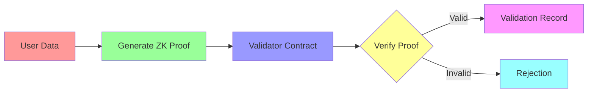

```rust
#[contract]
pub struct ZKValidationContract {
    validators: Vec<Address>,
    validation_records: Map<Address, Vec<ValidationRecord>>,
    verification_keys: Map<ValidationType, VerificationKey>,
}

#[contractimpl]
impl ZKValidationContract {
    pub fn submit_proof(&mut self, 
        proof: ZKProof, 
        public_inputs: Vec<u8>, 
        validation_type: ValidationType
    ) -> Result<ValidationId, Error> {
        // Verify the zero-knowledge proof against public inputs
        // Store validation record if valid
        // Return validation ID
    }
    
    pub fn get_validation_status(&self, 
        validation_id: ValidationId
    ) -> ValidationStatus {
        // Return validation status without revealing private data
    }
}
```

### 5. Data Monetization with Revenue Sharing

Allows users to anonymously monetize their aggregated health data with pharmaceutical research, with transparent revenue sharing.

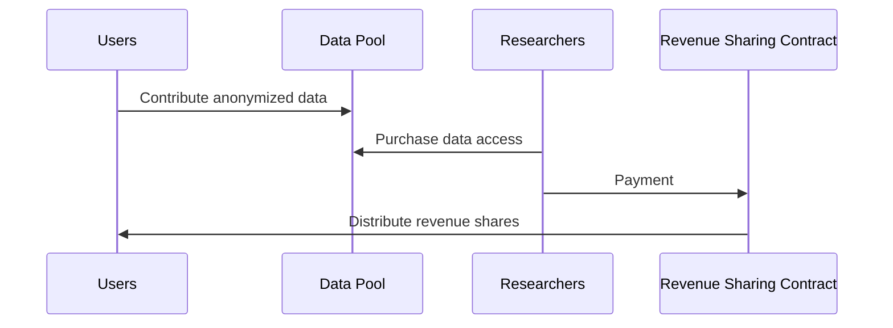

```rust
#[contract]
pub struct DataMarketplaceContract {
    data_pools: Map<PoolId, DataPool>,
    revenue_shares: Map<Address, Amount>,
    marketplace_fee: u32, // basis points
}

#[contractimpl]
impl DataMarketplaceContract {
    pub fn contribute_data(&mut self, 
        pool_id: PoolId, 
        data_hash: String
    ) -> Result<(), Error> {
        // Add user's data hash to the pool
        // Record contribution for revenue sharing
    }
    
    pub fn purchase_data_access(&mut self, 
        pool_id: PoolId, 
        amount: Amount
    ) -> Result<DataAccess, Error> {
        // Process payment
        // Calculate revenue shares
        // Distribute to contributors
        // Grant access to researcher
    }
    
    pub fn claim_revenue(&mut self) -> Result<(), Error> {
        // Allow user to claim accumulated revenue shares
    }
}
```

### 6. Turret-based Automated Health Alerts

Deploys Stellar Turrets to monitor health data and trigger automated alerts for concerning patterns without compromising privacy.

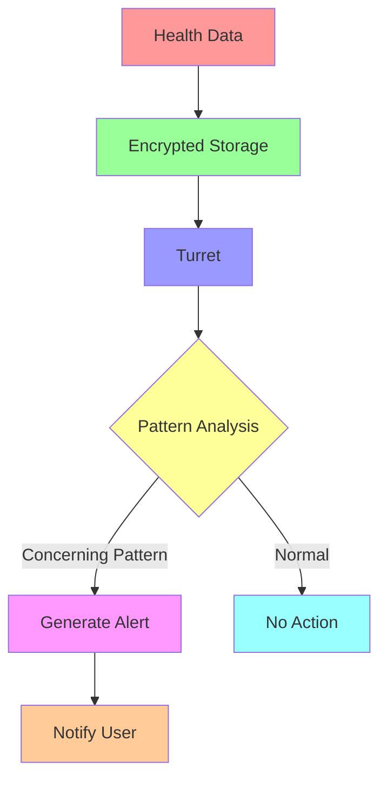

```rust
#[contract]
pub struct HealthAlertContract {
    alert_configurations: Map<Address, AlertConfig>,
    turret_endpoints: Vec<String>,
    alerts: Map<Address, Vec<Alert>>,
}

#[contractimpl]
impl HealthAlertContract {
    pub fn configure_alerts(&mut self, 
        config: AlertConfig
    ) -> Result<(), Error> {
        // Store user's alert preferences
        // Deploy monitoring function to Turret
    }
    
    pub fn process_health_data(&mut self, 
        user: Address, 
        encrypted_data: EncryptedData
    ) -> Result<Vec<Alert>, Error> {
        // Send data to Turret for analysis
        // Generate alerts based on patterns detected
        // Return new alerts
    }
    
    pub fn get_alerts(&self, 
        user: Address
    ) -> Vec<Alert> {
        // Retrieve alerts for user
    }
}
```

## Best Practices

1. **Security**
   - Use access control
   - Validate inputs
   - Handle errors gracefully

2. **Performance**
   - Optimize storage
   - Minimize operations
   - Batch updates

3. **Maintenance**
   - Document changes
   - Version contracts
   - Plan upgrades

## Development Tools

1. **Local Development**
   ```bash
   # Start local network
   stellar-cli network start
   
   # Deploy contract
   stellar-cli deploy --local
   
   # Run tests
   cargo test
   ```

2. **Debugging**
   ```bash
   # View contract logs
   stellar-cli logs --contract data
   
   # Inspect state
   stellar-cli state --contract data
   ```

## Resources

- [Stellar Smart Contracts Guide](https://developers.stellar.org/docs/smart-contracts)
- [Rust Documentation](https://doc.rust-lang.org/book/)
- [Security Best Practices](https://stellar.org/security)

## Support

For smart contract support:
- GitHub Issues
- Developer Discord
- Email: contracts@cyclebuddy.com 