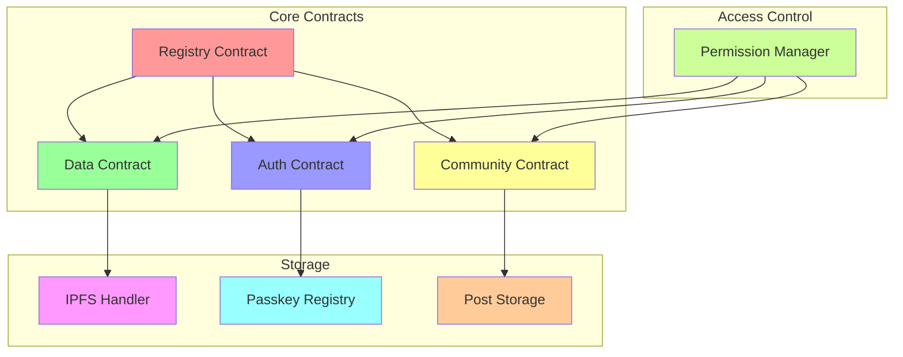
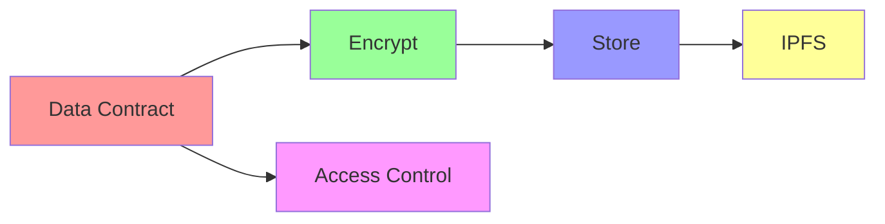
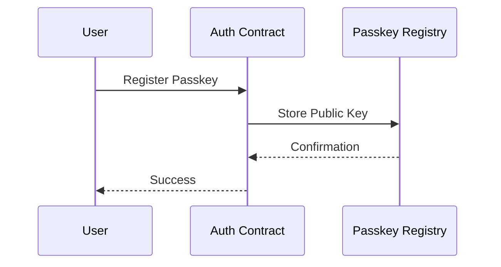
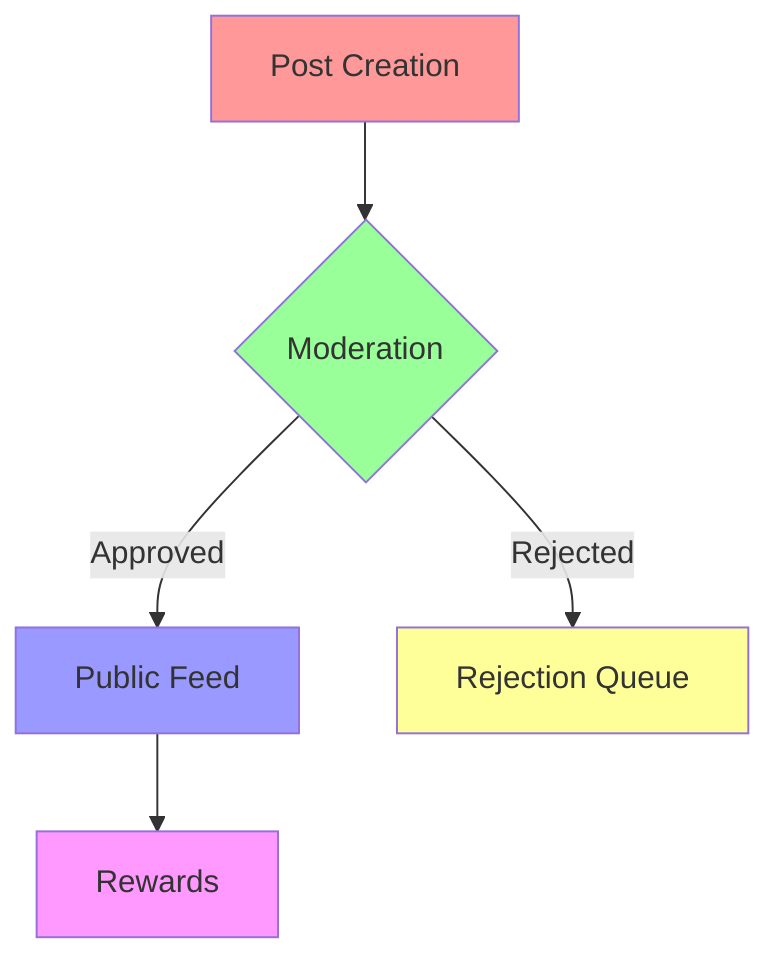
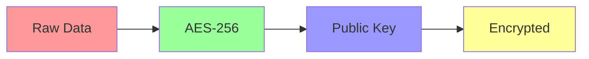
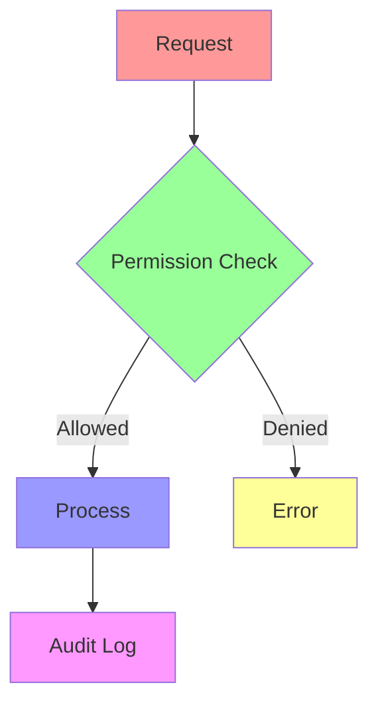
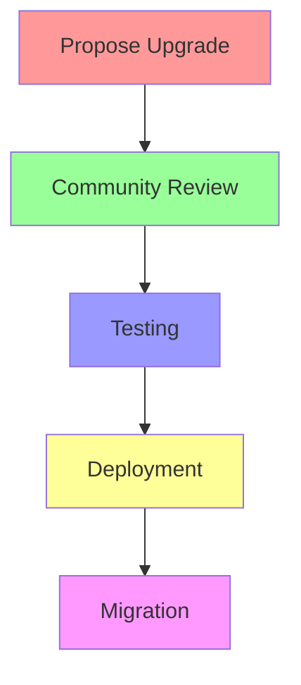

# 📝 CycleBuddy Smart Contracts

## Overview

CycleBuddy's smart contracts are built on the Stellar blockchain, providing secure, private, and efficient data management for user information and community interactions.

## Contract Architecture



## Contract Components

### 1. Registry Contract

```rust
#[contract]
pub struct RegistryContract {
    owner: Address,
    contracts: Map<ContractType, Address>,
    admins: Vec<Address>,
}

#[contractimpl]
impl RegistryContract {
    pub fn register_contract(&mut self, contract_type: ContractType, address: Address) -> Result<(), Error> {
        // Implementation
    }
    
    pub fn get_contract(&self, contract_type: ContractType) -> Option<Address> {
        // Implementation
    }
}
```

### 2. Data Contract



```rust
#[contract]
pub struct DataContract {
    owner: Address,
    data_store: Map<Address, Vec<EncryptedData>>,
    permissions: Map<Address, AccessLevel>,
}

#[contractimpl]
impl DataContract {
    pub fn store_data(&mut self, data: Vec<u8>) -> Result<(), Error> {
        // Implementation
    }
    
    pub fn retrieve_data(&self, user: Address) -> Result<Vec<u8>, Error> {
        // Implementation
    }
}
```

### 3. Auth Contract



```rust
#[contract]
pub struct AuthContract {
    passkeys: Map<Address, PublicKey>,
    nonces: Map<Address, u64>,
    recovery_keys: Map<Address, Vec<Address>>,
}

#[contractimpl]
impl AuthContract {
    pub fn register_passkey(&mut self, public_key: PublicKey) -> Result<(), Error> {
        // Implementation
    }
    
    pub fn verify_signature(&self, signature: Signature, message: Vec<u8>) -> bool {
        // Implementation
    }
}
```

### 4. Community Contract



```rust
#[contract]
pub struct CommunityContract {
    posts: Map<PostId, Post>,
    moderators: Vec<Address>,
    rewards: Map<Address, Balance>,
}

#[contractimpl]
impl CommunityContract {
    pub fn create_post(&mut self, content: Vec<u8>) -> Result<PostId, Error> {
        // Implementation
    }
    
    pub fn moderate_post(&mut self, post_id: PostId, decision: Decision) -> Result<(), Error> {
        // Implementation
    }
}
```

## Data Structures

### 1. User Data

```rust
#[derive(Serialize, Deserialize)]
pub struct CycleData {
    timestamp: u64,
    symptoms: Vec<Symptom>,
    mood: Mood,
    notes: Option<String>,
    metadata: Metadata,
}

#[derive(Serialize, Deserialize)]
pub struct EncryptedData {
    data: Vec<u8>,
    public_key: PublicKey,
    nonce: [u8; 24],
}
```

### 2. Access Control

```rust
#[derive(Serialize, Deserialize)]
pub enum AccessLevel {
    Owner,
    ReadWrite,
    ReadOnly,
    None,
}

#[derive(Serialize, Deserialize)]
pub struct Permission {
    user: Address,
    level: AccessLevel,
    expiry: Option<u64>,
}
```

## Security Features

### 1. Encryption



### 2. Access Control



## Contract Deployment

### 1. Testnet Deployment

```bash
# Build contracts
cargo build --target wasm32-unknown-unknown --release

# Deploy to testnet
stellar-cli deploy \
    --network testnet \
    --contract registry.wasm \
    --signer admin.key
```

### 2. Mainnet Deployment

```bash
# Security audit
cargo audit

# Deploy to mainnet
stellar-cli deploy \
    --network mainnet \
    --contract registry.wasm \
    --signer production.key
```

## Testing

### 1. Unit Tests

```rust
#[cfg(test)]
mod tests {
    use super::*;
    
    #[test]
    fn test_data_storage() {
        // Test implementation
    }
    
    #[test]
    fn test_access_control() {
        // Test implementation
    }
}
```

### 2. Integration Tests

```rust
#[cfg(test)]
mod integration_tests {
    #[test]
    fn test_contract_interaction() {
        // Test implementation
    }
}
```

## Contract Upgrades

### Upgrade Process



### Migration

```rust
pub trait Migratable {
    fn migrate(&mut self) -> Result<(), Error>;
}

impl Migratable for DataContract {
    fn migrate(&mut self) -> Result<(), Error> {
        // Migration implementation
    }
}
```

## Error Handling

### Error Types

```rust
#[derive(Debug)]
pub enum ContractError {
    Unauthorized,
    InvalidInput,
    StorageError,
    NetworkError,
    // Other error types
}

impl From<ContractError> for Error {
    fn from(error: ContractError) -> Self {
        // Implementation
    }
}
```

## Events

### Event Types

```rust
#[derive(Serialize)]
pub enum ContractEvent {
    DataStored {
        user: Address,
        timestamp: u64,
    },
    AccessGranted {
        from: Address,
        to: Address,
        level: AccessLevel,
    },
    PostCreated {
        id: PostId,
        author: Address,
    },
}
```

## Best Practices

1. **Security**
   - Use access control
   - Validate inputs
   - Handle errors gracefully

2. **Performance**
   - Optimize storage
   - Minimize operations
   - Batch updates

3. **Maintenance**
   - Document changes
   - Version contracts
   - Plan upgrades

## Development Tools

1. **Local Development**
   ```bash
   # Start local network
   stellar-cli network start
   
   # Deploy contract
   stellar-cli deploy --local
   
   # Run tests
   cargo test
   ```

2. **Debugging**
   ```bash
   # View contract logs
   stellar-cli logs --contract data
   
   # Inspect state
   stellar-cli state --contract data
   ```

## Resources

- [Stellar Smart Contracts Guide](https://developers.stellar.org/docs/smart-contracts)
- [Rust Documentation](https://doc.rust-lang.org/book/)
- [Security Best Practices](https://stellar.org/security)

## Support

For smart contract support:
- GitHub Issues
- Developer Discord
- Email: contracts@cyclebuddy.com 