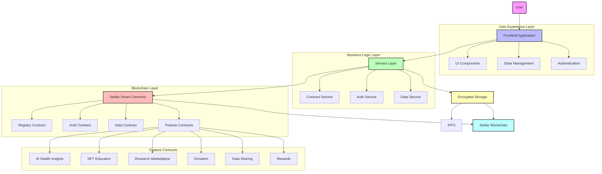
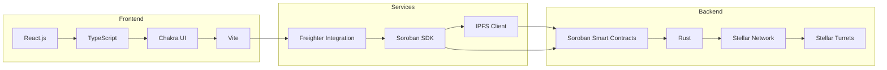
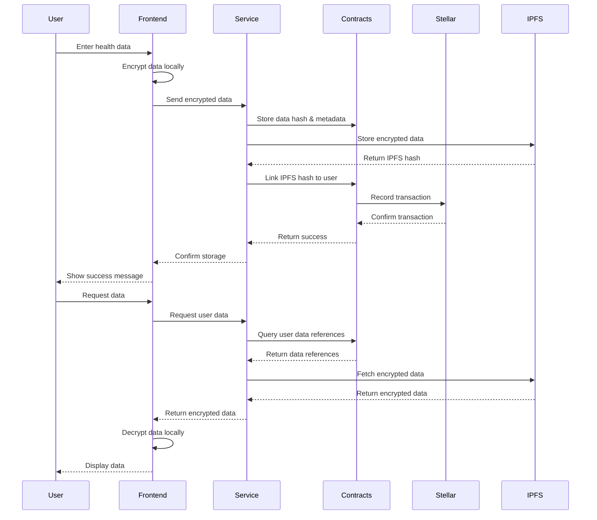
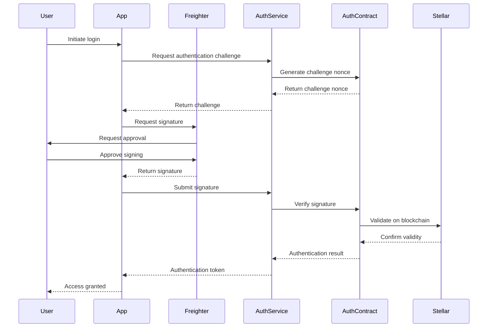
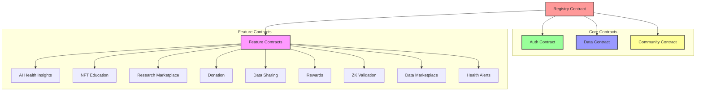
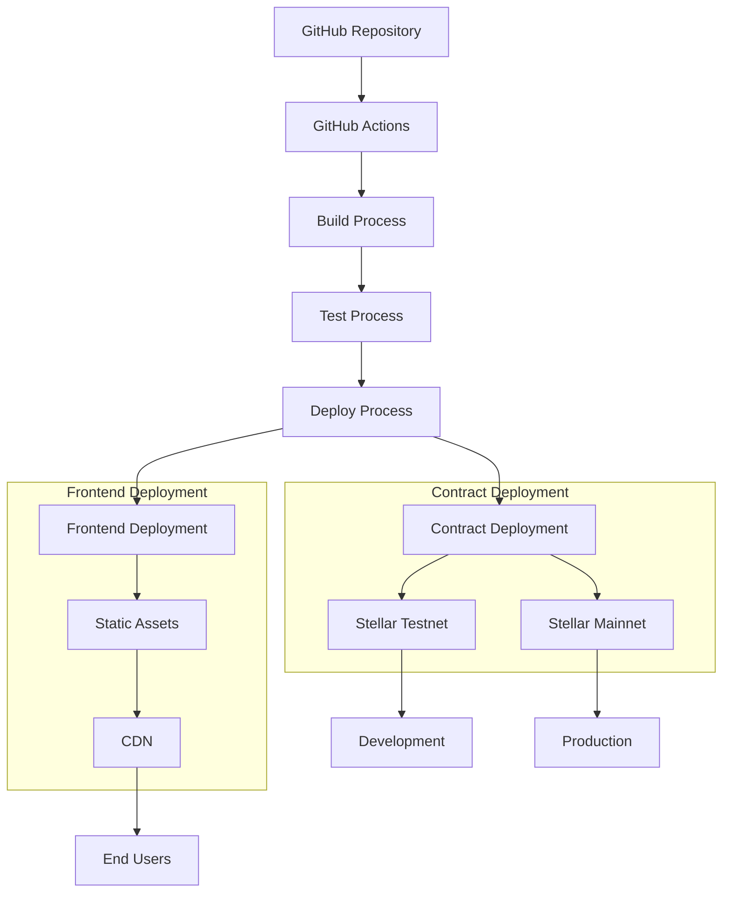
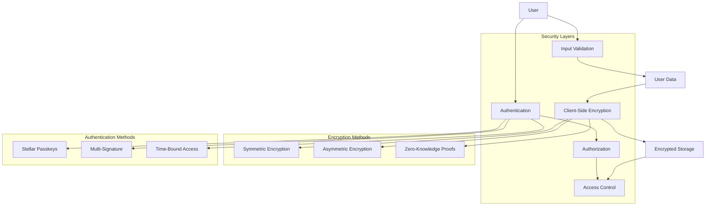
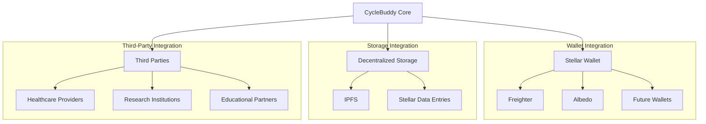
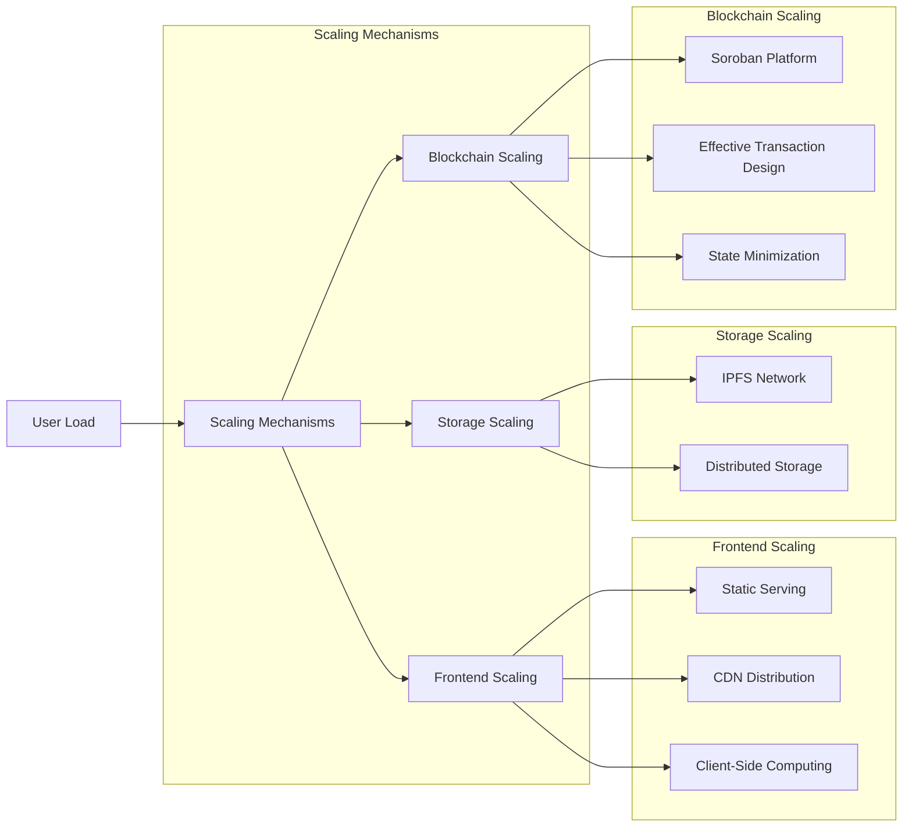
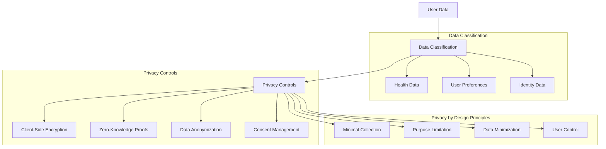

# 🏗️ CycleBuddy System Architecture

This document provides a comprehensive overview of CycleBuddy's system architecture, showing how different components interact to create a secure, private, and user-friendly menstrual health tracking application on the Stellar blockchain.

## System Overview



## Technical Stack

CycleBuddy leverages modern technologies to create a secure, scalable, and user-friendly application:



## Data Flow Architecture

This diagram illustrates how data flows through the system, highlighting the security measures at each stage:



## Authentication Flow

CycleBuddy uses Stellar Passkeys for secure, decentralized authentication:



## Contract Architecture

The smart contract architecture employs a registry pattern for upgradability and modular design:



## Frontend Component Architecture

The frontend architecture follows a component-based design pattern for modularity and reusability:

```mermaid
graph TD
    App[App.tsx] --> Router[Router]
    Router --> Pages[Pages]
    Router --> Components[Components]
    
    subgraph "Pages"
        Pages --> DashboardPage[Dashboard]
        Pages --> AuthPages[Auth Pages]
        Pages --> FeaturePages[Feature Pages]
    end
    
    subgraph "Feature Pages"
        FeaturePages --> AIPage[AI Health Insights]
        FeaturePages --> NFTPage[NFT Education]
        FeaturePages --> ResearchPage[Research Marketplace]
    end
    
    subgraph "Components"
        Components --> Layout[Layout Components]
        Components --> UI[UI Components]
        Components --> Forms[Form Components]
    end
    
    subgraph "Layout Components"
        Layout --> MainLayout[MainLayout]
        Layout --> Header[Header]
        Layout --> Footer[Footer]
    end
    
    subgraph "Services"
        AuthService[Auth Service]
        ContractService[Contract Service]
        DataService[Data Service]
    end
    
    DashboardPage --> AuthService
    DashboardPage --> ContractService
    AIPage --> ContractService
    NFTPage --> ContractService
    ResearchPage --> ContractService
```

## Deployment Architecture

The application's deployment architecture leverages modern cloud infrastructure for scalability and reliability:



## Security Architecture

Security is a fundamental aspect of CycleBuddy's architecture:



## Integration Architecture

CycleBuddy integrates with various external systems and services:



## Scalability Architecture

The architecture is designed to scale to accommodate a growing user base and feature set:



## Data Privacy Architecture

Privacy is a core architectural principle in CycleBuddy:



## Conclusion

CycleBuddy's architecture is designed with security, privacy, scalability, and user experience as core principles. By leveraging the Stellar blockchain and modern web technologies, we've created a system that empowers users with control over their health data while enabling innovative features that were previously impossible in traditional health applications.

The modular, contract-based design allows for future expansion and upgrades without compromising the security or integrity of existing user data. This architecture document serves as a guide for understanding the system's components and their interactions, providing a foundation for future development and enhancement. 