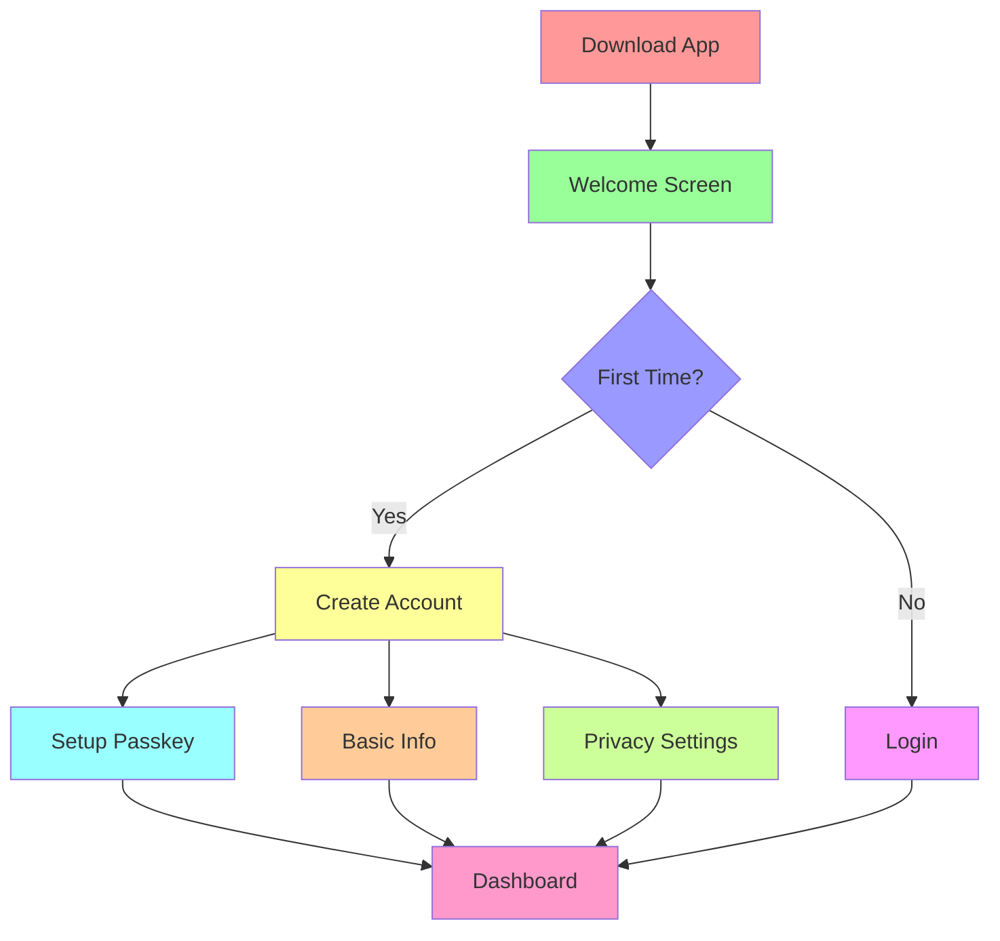
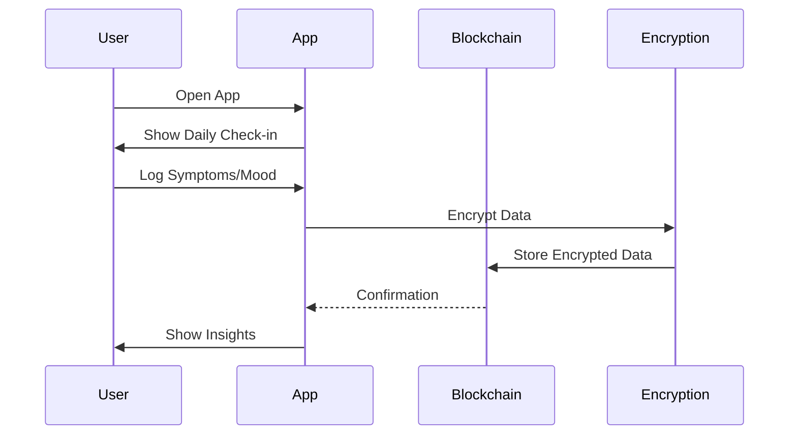
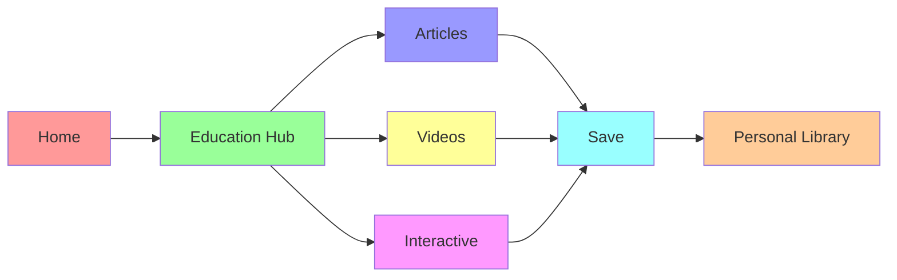
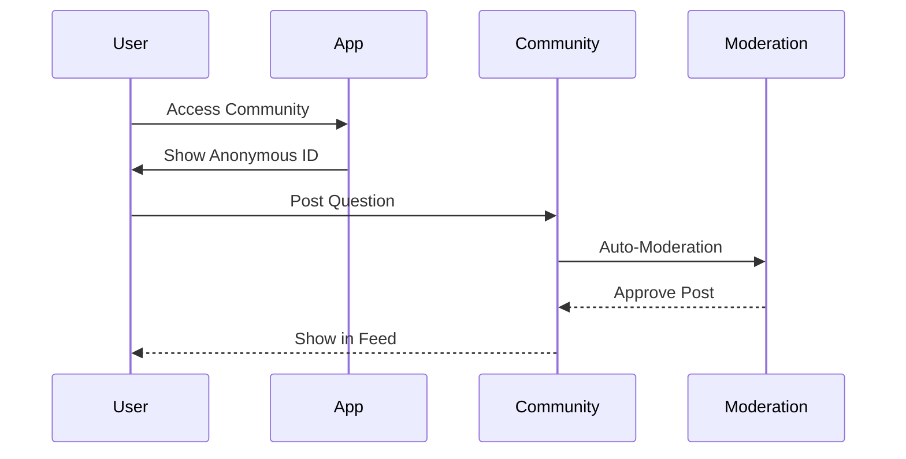
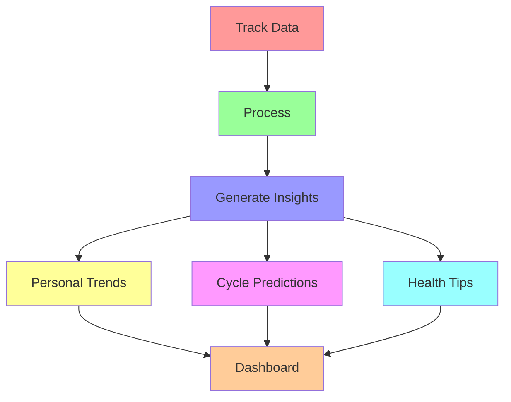
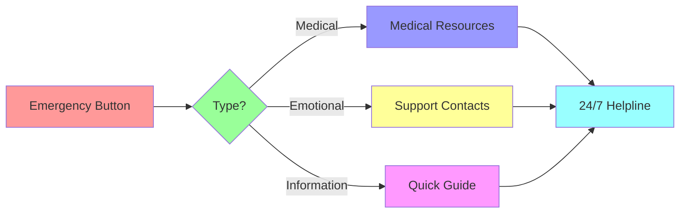
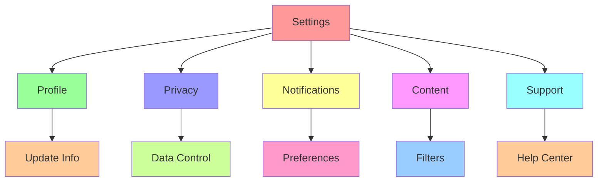

# 🔄 CycleBuddy User Flows

## Overview

This document outlines the key user flows in CycleBuddy, demonstrating how users interact with various features of the application. Each flow is designed to be intuitive, secure, and privacy-focused.

## 1. User Onboarding

### Steps:
1. **Welcome Screen**
   - App introduction
   - Privacy commitment
   - Key features overview

2. **Account Creation**
   - Passkey setup using device biometrics
   - Optional email backup
   - Age-appropriate content settings

3. **Basic Information**
   - Cycle history (if known)
   - Symptoms tracking preferences
   - Educational content level

4. **Privacy Settings**
   - Data sharing preferences
   - Community participation options
   - Notification settings

## 2. Daily Tracking Flow

### Features:
1. **Quick Log**
   - One-tap mood tracking
   - Symptom selection
   - Notes (optional)

2. **Daily Insights**
   - Cycle phase
   - Predicted symptoms
   - Wellness tips

3. **Data Privacy**
   - Local encryption
   - Blockchain storage
   - Zero-knowledge proof

## 3. Educational Content Access

### Content Types:
1. **Articles**
   - Age-appropriate
   - Science-based
   - Easy to understand

2. **Videos**
   - Animated explanations
   - Expert interviews
   - User testimonials

3. **Interactive Content**
   - Quizzes
   - Games
   - Learning modules

## 4. Community Interaction

### Features:
1. **Anonymous Posting**
   - Random usernames
   - No personal info
   - Encrypted connections

2. **Support Features**
   - Topic categories
   - Helpful responses
   - Resource sharing

3. **Safety Measures**
   - Content moderation
   - Report system
   - Age restrictions

## 5. Health Insights

### Components:
1. **Data Analysis**
   - Pattern recognition
   - Trend identification
   - Anomaly detection

2. **Predictions**
   - Next cycle
   - Symptom likelihood
   - Mood patterns

3. **Recommendations**
   - Lifestyle tips
   - Exercise suggestions
   - Nutrition advice

## 6. Emergency Support

### Features:
1. **Quick Access**
   - One-tap help
   - Location services
   - Emergency contacts

2. **Resource Types**
   - Medical facilities
   - Mental health support
   - Educational resources

3. **Privacy Control**
   - Discreet mode
   - Data sharing options
   - Contact preferences

## 7. Settings and Customization

### Options:
1. **Profile Management**
   - Personal information
   - Preferences
   - Account security

2. **Privacy Controls**
   - Data sharing
   - Storage options
   - Export capabilities

3. **App Customization**
   - Theme selection
   - Language options
   - Content filters

## Best Practices

1. **User Experience**
   - Minimal clicks
   - Clear navigation
   - Helpful feedback

2. **Privacy**
   - Default privacy
   - Explicit consent
   - Data control

3. **Security**
   - Encrypted storage
   - Secure transmission
   - Regular audits

## Future Enhancements

1. **AI Integration**
   - Smart predictions
   - Personalized insights
   - Pattern recognition

2. **Social Features**
   - Group support
   - Shared resources
   - Mentor system

3. **Healthcare Integration**
   - Provider connections
   - Data sharing
   - Appointment scheduling 