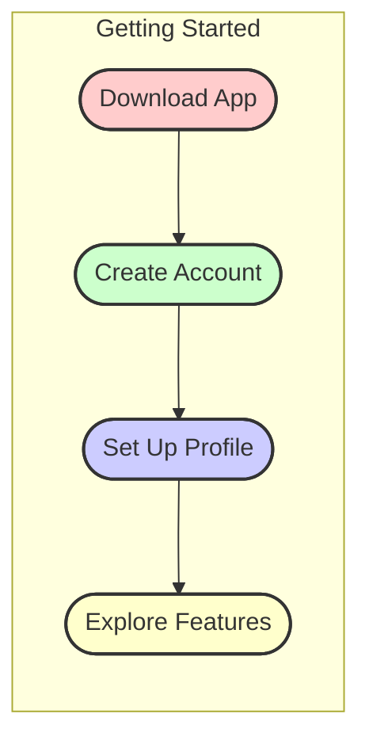
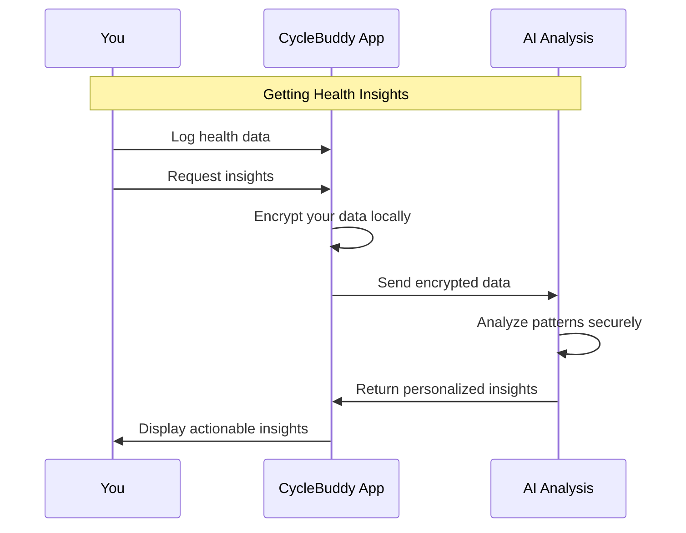
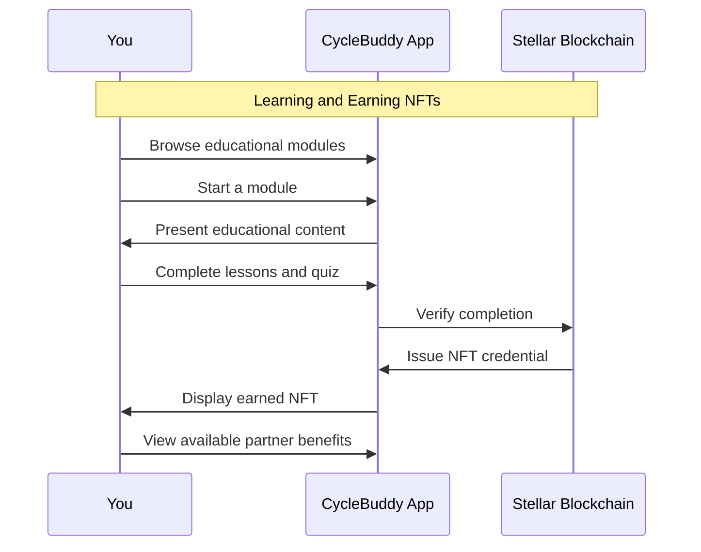
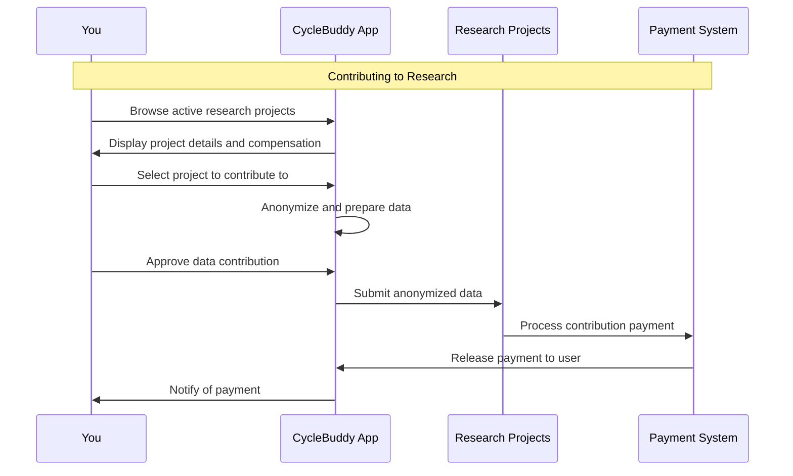
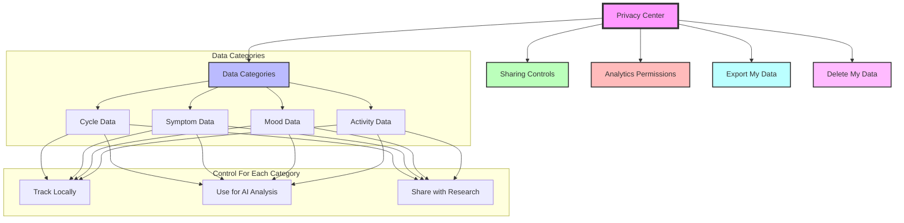
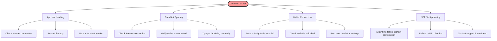

# 📱 CycleBuddy User Guide

Welcome to CycleBuddy! This guide will help you get the most out of our application's breakthrough features, empowering you to take control of your menstrual health in a private, educational, and rewarding way.

## Quick Start Guide



### 1. Download and Install
- Visit the app store or our website to download CycleBuddy
- Install the app on your device

### 2. Create Your Account
- Set up your account using the Stellar Passkey system for enhanced security
- Your identity remains private and secured through blockchain technology
- No personal identifying information is required

### 3. Set Up Your Profile
- Enter basic information about your cycle (completely optional)
- Set your preferences for privacy and notifications
- Select your areas of interest for educational content

## Dashboard Overview

Your dashboard is the central hub for all CycleBuddy features:

```mermaid
graph TD
    Dashboard[Dashboard] --> TrackCycle[Cycle Tracking]
    Dashboard --> AIInsights[AI Health Insights]
    Dashboard --> Education[NFT Education]
    Dashboard --> Research[Research Marketplace]
    
    subgraph "Quick Actions"
        TrackCycle --> LogPeriod[Log Period]
        TrackCycle --> LogSymptoms[Log Symptoms]
        TrackCycle --> ViewHistory[View History]
    end
    
    subgraph "Health Intelligence"
        AIInsights --> GenerateInsights[Generate Insights]
        AIInsights --> ViewRecommendations[View Recommendations]
        AIInsights --> ExplorePatterns[Explore Patterns]
    end
    
    subgraph "Learning Journey"
        Education --> ViewModules[Browse Modules]
        Education --> ContinueLearning[Continue Learning]
        Education --> ViewNFTs[View My NFTs]
    end
    
    subgraph "Research"
        Research --> BrowseProjects[Browse Projects]
        Research --> MyContributions[My Contributions]
        Research --> ClaimPayments[Claim Payments]
    end
    
    style Dashboard fill:#f9f,stroke:#333,stroke-width:4px
    style TrackCycle fill:#bbf,stroke:#333,stroke-width:2px
    style AIInsights fill:#bfb,stroke:#333,stroke-width:2px
    style Education fill:#fbb,stroke:#333,stroke-width:2px
    style Research fill:#bff,stroke:#333,stroke-width:2px
```

## AI Health Insights Feature Guide



### How to Use AI Health Insights:

1. **Access the Feature**
   - Tap the "AI Health Insights" tab on your dashboard
   - You'll see any existing insights or an option to generate new ones

2. **Generate New Insights**
   - Select an AI model from the dropdown menu
   - Tap "Generate Insights" button
   - Your data is analyzed securely while maintaining privacy

3. **Explore Your Insights**
   - View insights categorized by importance (Informational, Advisory, Alert)
   - Tap on any insight to see detailed information and recommendations
   - Use the information to make informed health decisions

4. **Privacy and Security**
   - All processing happens on encrypted data
   - No raw health data ever leaves your device
   - You control which types of insights are generated

## NFT Education Feature Guide



### How to Use NFT Education:

1. **Browse Educational Modules**
   - Tap the "NFT Education" tab on your dashboard
   - Browse modules organized by skill level and topic
   - View prerequisites and completion rewards

2. **Start a Module**
   - Select a module that interests you
   - Tap "Start Module" to begin learning
   - Read through the educational content at your own pace

3. **Complete Assessments**
   - Take quizzes to test your knowledge
   - Complete required tasks to demonstrate understanding
   - Track your progress within each module

4. **Earn NFT Credentials**
   - Upon successful completion, earn a unique NFT credential
   - The NFT proves your knowledge in that specific health topic
   - Your credentials are stored securely in your personal collection

5. **Access Partner Benefits**
   - Browse the "Partner Benefits" section to see what your NFTs unlock
   - Use your credentials to access special services or discounts
   - Build a comprehensive education profile over time

## Research Marketplace Feature Guide



### How to Use Research Marketplace:

1. **Browse Research Projects**
   - Tap the "Research Marketplace" tab on your dashboard
   - View active research projects with ethical approval
   - See compensation rates and project details

2. **Choose Projects to Support**
   - Select projects that align with your interests
   - Review exactly what anonymous data you'll be contributing
   - Verify the project's ethical approval status

3. **Contribute Your Data**
   - Choose which categories of anonymous data to share
   - Approve the contribution
   - Your data is anonymized and stripped of identifying information

4. **Track Contributions and Earnings**
   - View your contribution history
   - See your impact on research projects
   - Track your reputation score as it grows

5. **Claim Payments**
   - Receive notifications when payments are available
   - Claim your compensation directly to your Stellar wallet
   - Access your complete payment history

## Privacy Settings and Controls

CycleBuddy puts you in control of your privacy at all times:



## Tips for Getting the Most Out of CycleBuddy

### For Cycle Tracking
- Log your period regularly for the most accurate predictions
- Track symptoms consistently to enable better pattern detection
- Use the notes feature to record additional observations

### For AI Health Insights
- The more data you log, the more personalized your insights will be
- Check insights regularly but remember they are not medical advice
- Discuss significant insights with healthcare professionals

### For NFT Education
- Start with basic modules before advancing to more complex topics
- Complete all module sections for the best learning experience
- Use earned knowledge to make informed health decisions

### For Research Marketplace
- Contribute to a variety of projects to build your reputation score
- Check back regularly for new research opportunities
- Understand that your contributions help advance health research

## Troubleshooting



## Getting Help

If you need assistance with any aspect of CycleBuddy:

1. **In-App Help**
   - Tap the question mark icon on any screen for contextual help
   - Visit the Help Center from the main menu

2. **Community Support**
   - Join our community forum to connect with other users
   - Share experiences and ask questions in a supportive environment

3. **Contact Support**
   - Email our support team at support@cyclebuddy.app
   - Use the "Contact Support" form in the app

## Your Privacy Promise

At CycleBuddy, we're committed to your privacy. We will never:

- Sell your personal data
- Share your information without your explicit consent
- Store unencrypted health data
- Track you across the web

Your health data belongs to you, and you alone control how it's used. 